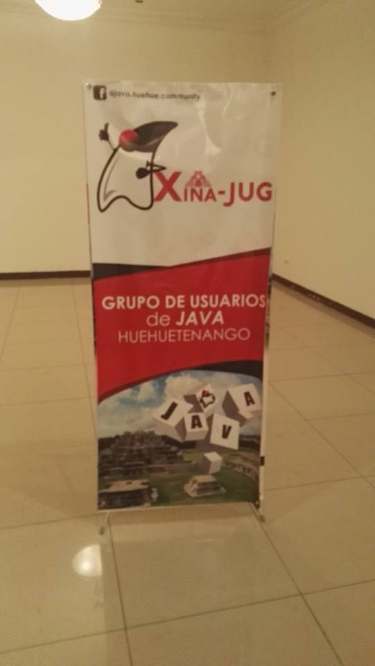
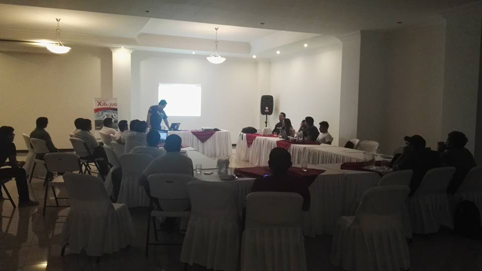
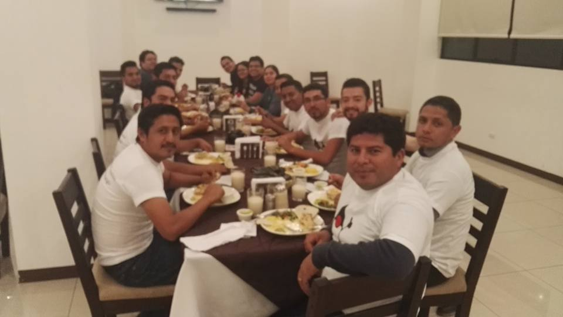

{:title "XinaJUG, nuevo JUG en Guatemala"
 :layout :post
 :tags  ["tour","occidente"]
 :toc true}

Luego de nuestra primer visita a la ciudad de Huehuetenango nos enteramos con mucha satisfacción que existia un grupo de entusiastas deseosos de iniciar su propio Java User Group, y oficialmente convertirse en el **primer JUG del Occidente del país**, denominado [**XinaJUG**](https://www.facebook.com/java.huehue.community).

En esta oportunidad participaron por parte de GuateJUG:

* Servicios REST con Jersey y Graddle por Jorge Cajas [@Jac_Mota](https://twitter.com/Jac_Mota)
* Desarrollo web con Java y Primefaces por Mario Batres [@mariobatres7](https://twitter.com/mariobatres7)

Algunas imagenes del evento:

Agradecemos a los organizadores del evento por la invitación, y esperamos poder trabajar en conjunto en proximas actividades.
