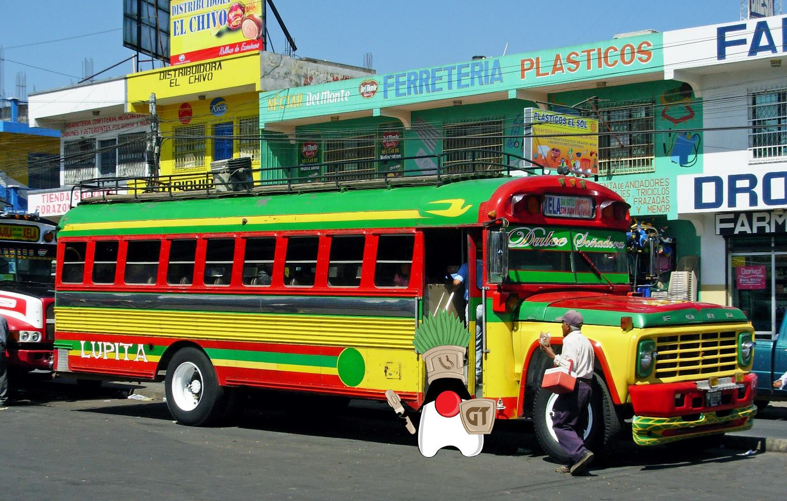
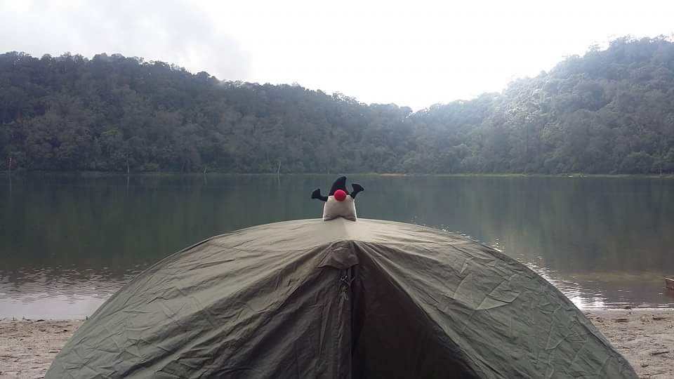

{:title "Acerca De"
 :layout :page
 :page-index 1
 :navbar? true}

### Las aventuras de Duke

Guatemala es uno de los paises de America Central con **una de las menores tazas de estudiantes universitarios de America Latina**, actualmente solo el 2% de la población tiene acceso a educación universitaria y tan solo 2% del 7% original obtiene un titulo universitario -i.e. 0.29 % de la población-, siendo uno de los paises con menos estudiantes en carreras de [ciencia y tecnologia](http://contrapoder.com.gt/2015/06/29/guatemala-pocos-universitarios-muchos-abogados/).

Sin embargo, es por muchos sabido que **no necesitas un titulo universitario para desempeñarte en el area de IT si trabajas duro**. Por lo cual las ciencias de la computación estan ganando auge en Guatemala como una via hacia el desarrollo.

En GuateJUG quisimos apoyar esta tarea y en el año 2015 para promover nuestra conferencia anual [**Java Day Guatemala**](http://www.guate-jug.net/javaday2016) iniciamos una jornada de viajes a diversos de la republica, creando de forma "accidental" el proyecto **Java Day Guatemala Tour** al que cariñosamente nombramos **Las aventuras de duke**.

Con la colaboración de centros de estudios locales -e.g Universidades, Institutos, escuelas- iniciamos un viaje a las cuatro coordenadas de la republica. Combinando dos de nuestras pasiones:

* Viajar por nuestro país
* Java

Mediante charlas, conferencias y cursos rapidos los miembros y voluntarios de GuateJUG comparten su conocimiento acerca de tecnologias Java en cualquiera de sus plataformas, **contribuyendo al desarrollo del país**.

Para nosotros Las aventuras de Duke ha sido una oportunidad para redescubrir el pais, hacer amigos en cada región, y generar un impacto positivo en la vida de las personas, al mismo tiempo que generamos un impacto positivo en nosotros. **Solo hizo falta, una laptop, una mochila y una buena excusa** :).

Si deseas que las aventuras de Duke lleguen a tu ciudad escríbenos a <info@guate-jug.net>.
