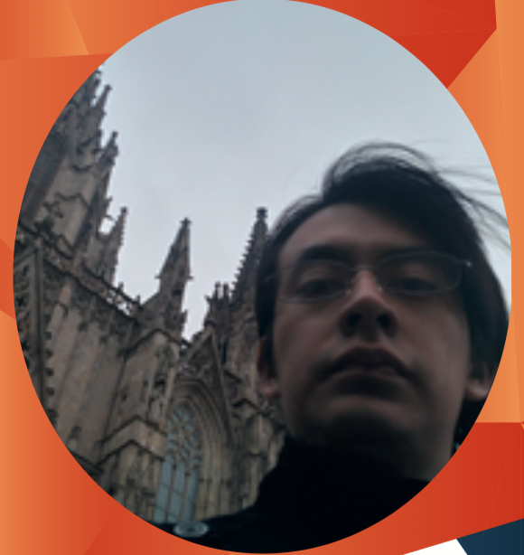
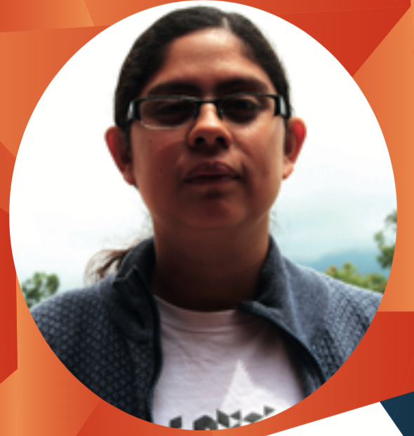
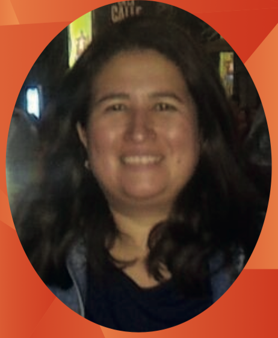
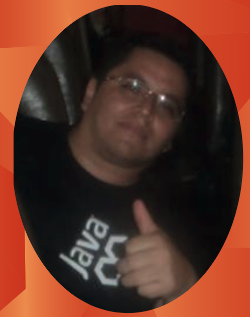
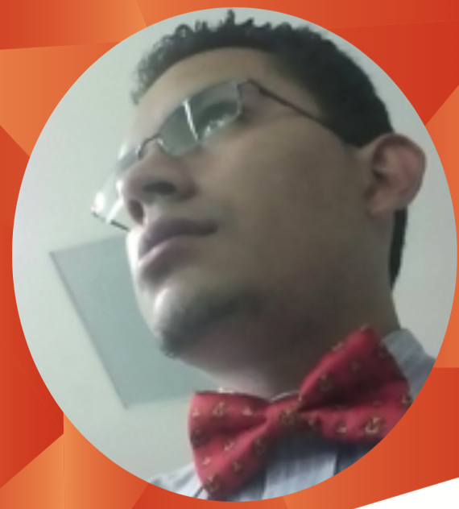

{:title "Expositores"
 :layout :page
 :page-index 2
 :navbar? true}

##Víctor Orozco - JUG Leader

Recientemente fue elegido como JUG Leader del grupo de usuarios Java de Guatemala. Cuenta con una Ingeniería en Ciencias y Sistemas por parte de la Universidad de San Carlos de Guatemala, y una maestría en Ciencias de la Computación por parte de la Universidad Federal de Santa Maria (Brasil) como becario de la Organización de Estados Americanos.

Desde hace 2 años es socio fundador de Nabenik S.A., una firma de consultoría de Software dedicada al desarrollo de aplicaciones enterprise y seguridad de sistemas de información, actuando como CTO. De forma paralela, es actual catedrático de Ingeniería en Sistemas en la Universidad Rafael Landivar de Guate- mala, en los cursos de Modelación y Simulación de Sistemas e Inteligencia Artificial.

##Mercedes Wyss - JDuchess Leader

Actualmente es la fundadora del capitulo [JDuchess](http://jduchess.org/) de Guatemala, Posee tres años de estudios en Ingeniería en Informatica y Sistemas en la Universidad Rafael Landívar de la Ciudad de Guatemala. Cuenta con 5 años de experiencia en el desarrollo de aplicaciones móviles android, desarrollo de Front-End y Back-End sobre el framework Play 1.x basado en Java, también cuenta con experiencia en el desarrollo de WS Restful y consumo de WS SOAP. Así mismo ha desarrollado aplicaciones para iOS y BlackBerry.

Actualmente es CTO en Produactivity, trabaja en crear PowerWTechnology su propia marca personal, dando consultorías y capacitaciones en el desarrollo de aplicaciones android, también se dedica al desarrollo de aplicaciones móviles y web. Ha trabajado aplicaciones financieras. Dentro de sus clientes se encuen- tran Mcdonals Guatemala, Black&Decker y Regminton Centro América.

##Maria Castillo - (ex)JUG Leader

Maria Castillo fungió durante 5 años como líder del grupo de usuarios Java de Guatemala, y es un personaje destacado dentro de las comunidades de Software Libre y Open Source de Centroamérica como miembro de la organización Software Libre Guatemala -SLGT-.

Estudió Licenciatura en Ingeniería en Informática y Sistemas en la Universidad Rafael Landivar de Guatemala. Desarrollo desde los 18 años en tecnologías Java (desde la versión 1.1). Es miembro activo del Grupo de Usuarios Java de Guatemala (GuateJUG) y la comunidad de Software Libre Guatemala.

Tiene experiencia en el análisis, diseño e implementación de aplicaciones empresariales. Capacitadora en Tecnologías Java. Miembro fundador de Open Training.

##Mario Batres - GuateJUG Advocate

Ingeniero en Ciencias y Sistemas de la Universidad de San Carlos de Guatemala, actual- mente estudia una maestria en Dirección de Proyectos en la Universidad Galileo. Es miembro fundador del grupo de Usuarios Java en Guatemala, GuateJUG.

Ha trabajado con Java desde su época como estudiante, así también en varias empresas dentro de Guatemala. Actualmente trabaja por su cuenta para varias empresas, así como en un start-up en conjunto con otros socios.

Trabaja con Java desde la versión JDK 1.3, con aplicaciones de escritorio (Swing), aplicaciones web o Java EE (JSP, Servlets, JSF), comunicación con base de datos por medio de JDBC y JPA (Hibernate, Open JPA, Eclipse Link), utilizando varios servidores de aplicaciones como Tomcat, OC4J de Oracle, Webshere Application Server de IBM, Glassfish de Oracle, Wildfly de JBoss.

##Jorge Cajas - GuateJUG Advocate

Estudiantes de 4to año de ingeniería en Sistemas de la Universidad de San Carlos de Guatemala.

Cuenta con dos años de desarrollo de Banca Virtual en ambiente Java / JSP, y tres años en desarrollo móvil android.

Fue conferencista en el Java Day 2012 y 2013 con el tema “JavaFX”, y para el Java Day 2015 con el tema “Anotaciones Java”. Es colaborador del Congreso de Estudiantes de Ciencias y Sistemas (Coecys) 2016.