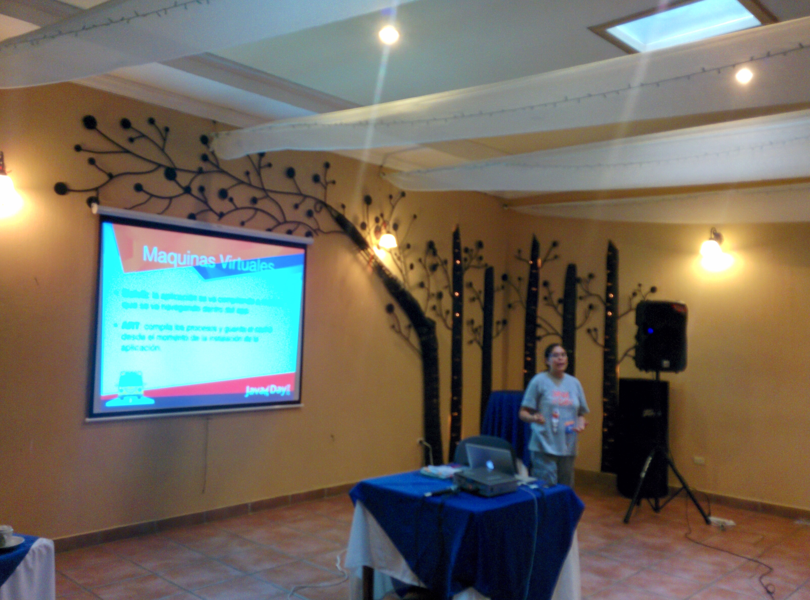
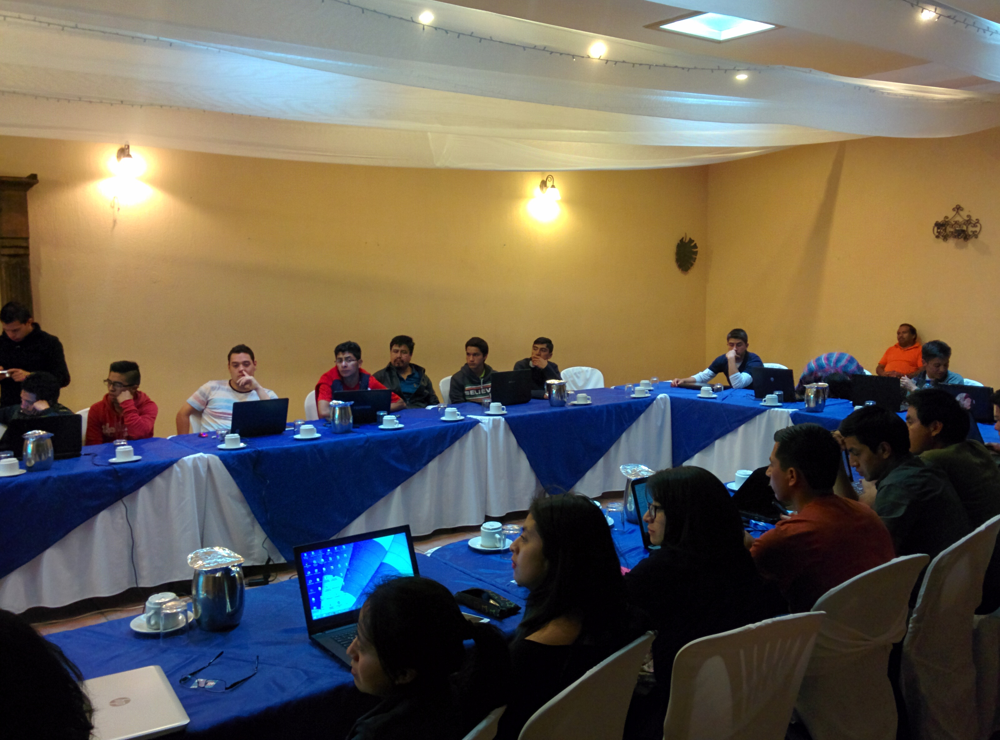
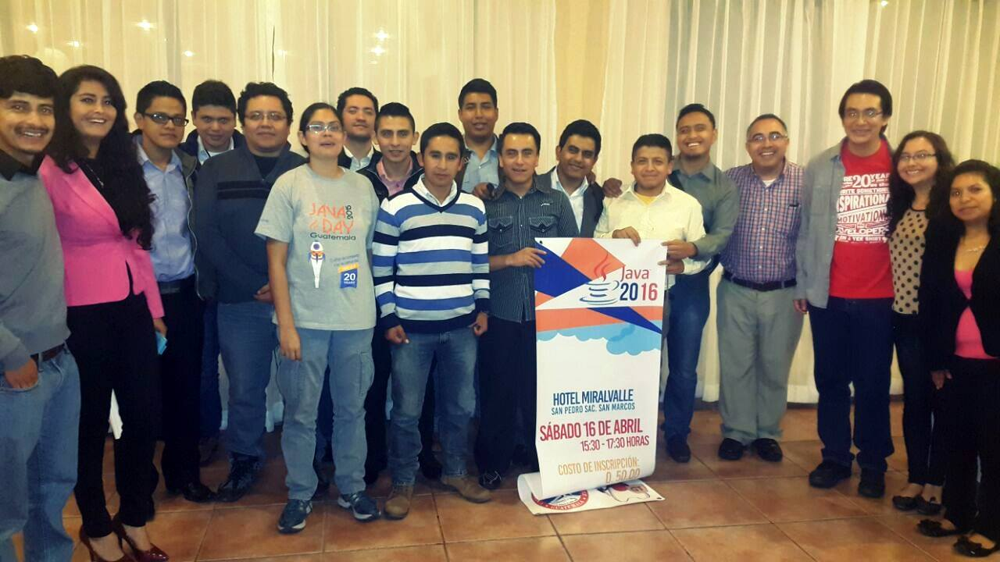

{:title "Inicio de la aventura en San Marcos"
 :layout :post
 :tags  ["guatejug","occidente"]
 :toc true}

Luego de nuestro primer viaje como Java User Group en el año 2015, **GuateJUG inicio su jornada de viajes por Guatemala** y la primera parada fue San Pedro Sacatepequez, San Marcos. Con el apoyo de la Universidad Mariano Galvez.

San Pedro Sacatepéquez es un municipio del departamento de San Marcos, en la República de Guatemala. La economía del municipio se basa en actividades **agrícolas, pecuarias, industriales** — principalmente la fabricación de instrumentos musicales, joyería, productos de cuero y panadería— y artesanales

En esta ocasión tuvimos la oportunidad de compartir con los alumnos de la Universidad y tambien con publico externo a la misma ya que se realizó un evento para todo publico, contando con las siguientes charas y talleres:

* Programación funcional en Java por Víctor Orozco [@tuxtor](https://twitter.com/tuxtor)
* Programación de listas en Android por Mercedes Wyss [@itrjwyss](https://twitter.com/itrjwyss)
* EJB y Primefaces por Mario Batres [@mariobatres7](https://twitter.com/mariobatres7)

Agradecemos a nuestro contacto **Ottoniel Hernandez** por facilitar nuestra visita y a nuestros anfitriones por un recibimiento inigualable.

