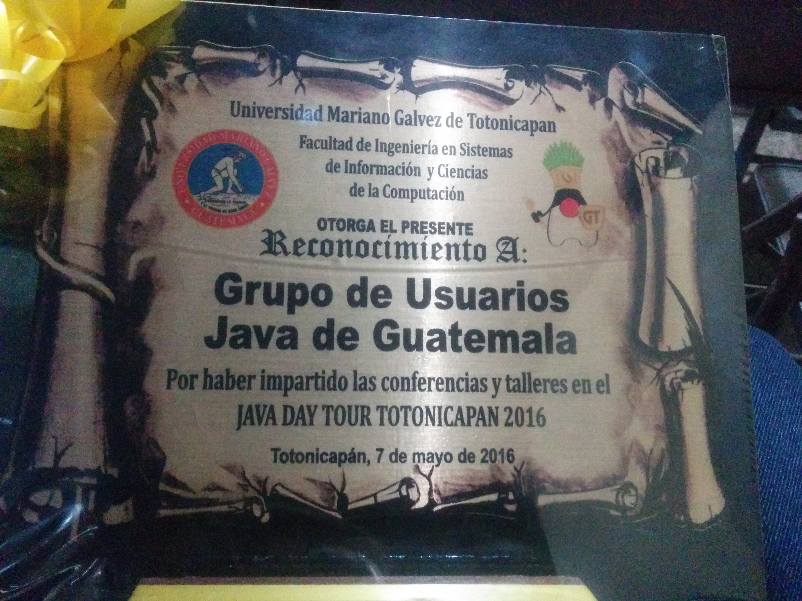
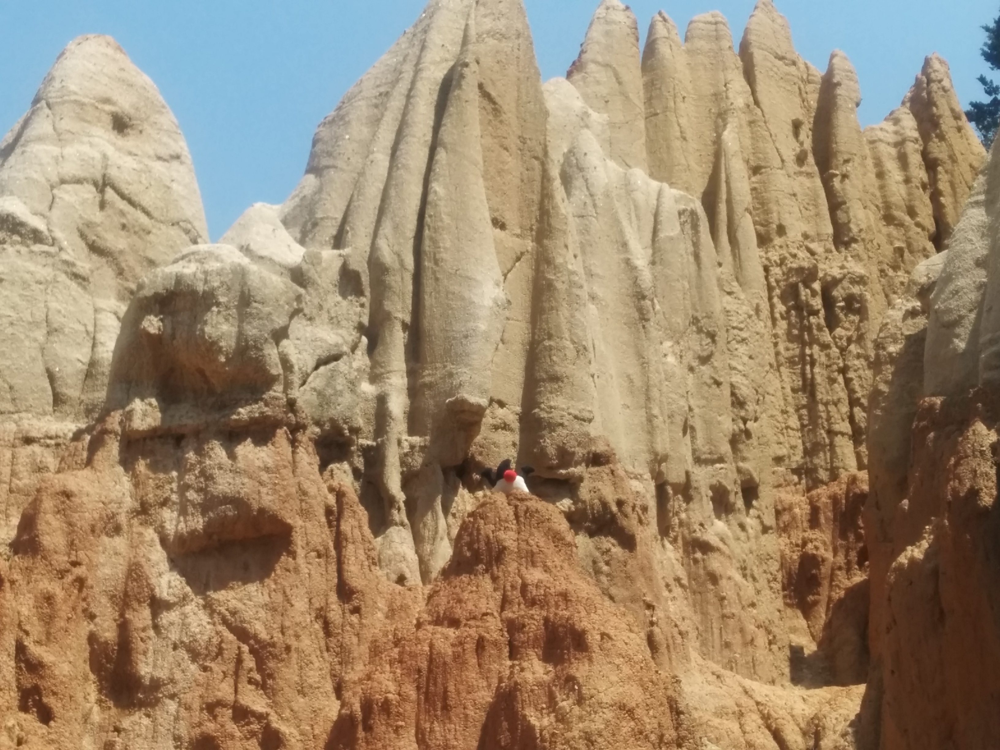
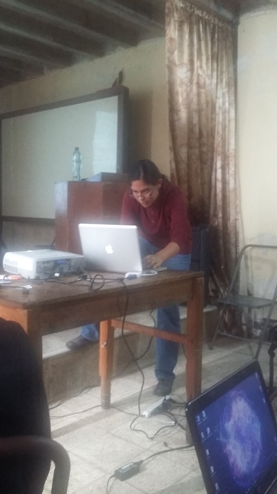
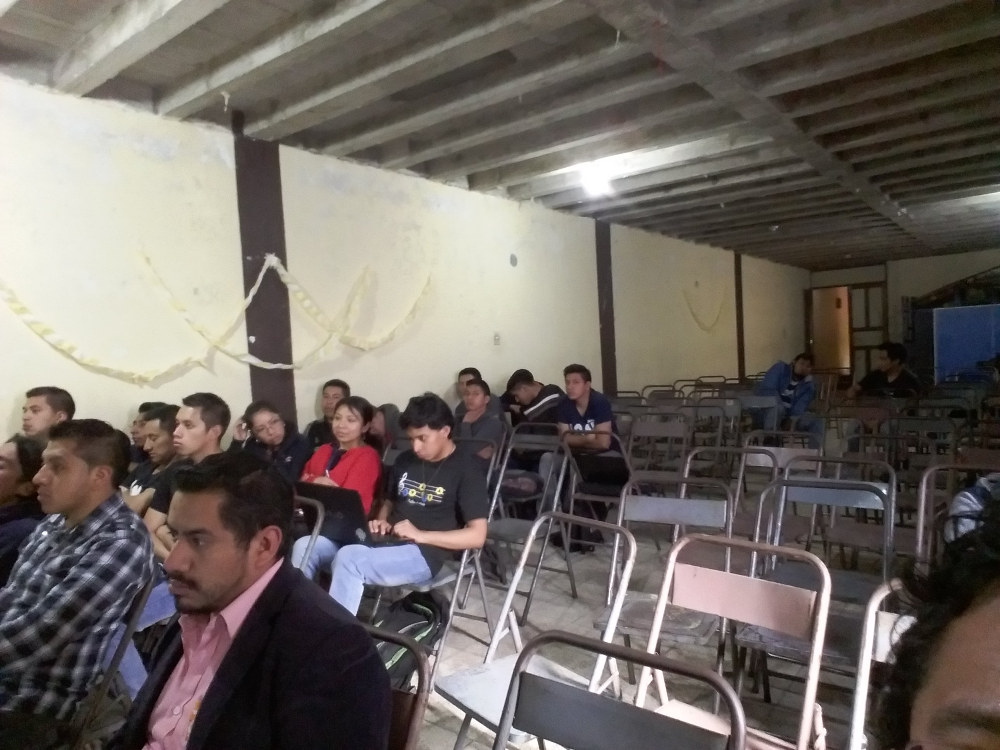
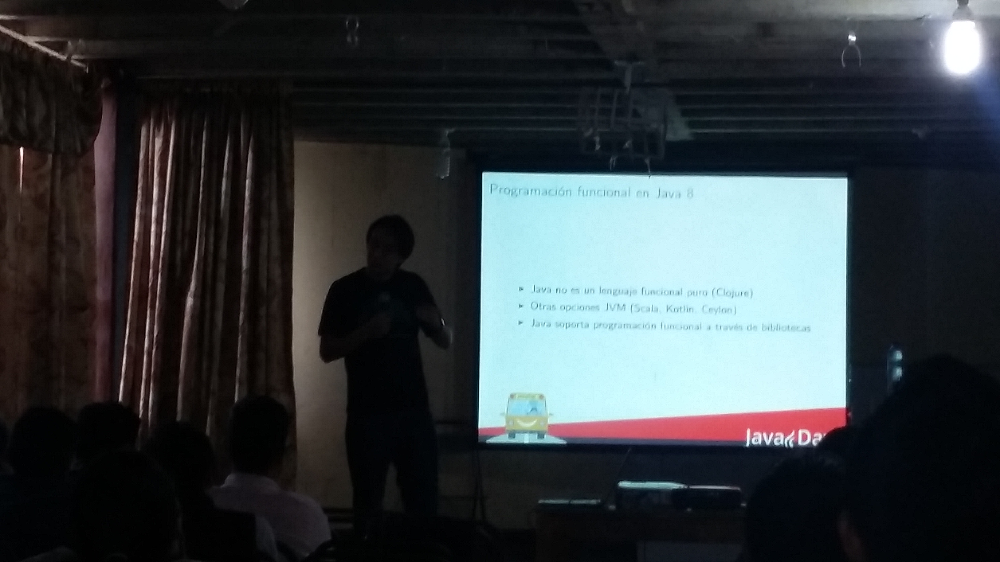

{:title "Java en Totonicapan"
 :layout :post
 :tags  ["guatejug","occidente"]
 :toc true}

La antigua Totonicapán, fue la segunda provincia en importancia del señorío Quiché gobernado desde Q'umarkaj (Utatlán), y entre otras cosas en el año de 1820, estalló entre los indígenas de Totonicapán, una sublevación en la que desconocieron a las autoridades españolas. Todo **un destino lleno de historia** :).

En esta oportunidad GuateJUG partició con una acividad exclusiva del **Java Day Tour Guatemala**, nuevamente apoyados por la Universidad Mariano Galvez, impartiendo los siguientes talleres:

* Como programar en Java por Víctor Orozco [@tuxtor](https://twitter.com/tuxtor)
* Introducción a la programación en Java por Maria Castillo [@marycoder](https://twitter.com/marycoder)
* Programación de listas en Android por Mercedes Wyss [@itrjwyss](https://twitter.com/itrjwyss)
* EJB y Primefaces por Mario Batres [@mariobatres7](https://twitter.com/mariobatres7)

Casualmente el tour coincidio con una feria de comercio internacional de la región por lo que además de hablar de Java, pudimos ver la vida nocturna del lugar asi como las **festividades tradicionales de Guatemala**.

Agradecemos a nuestro contacto **Benjamin** por facilitar nuestra visita y a nuestros anfitriones por un recibimiento inigualable.

