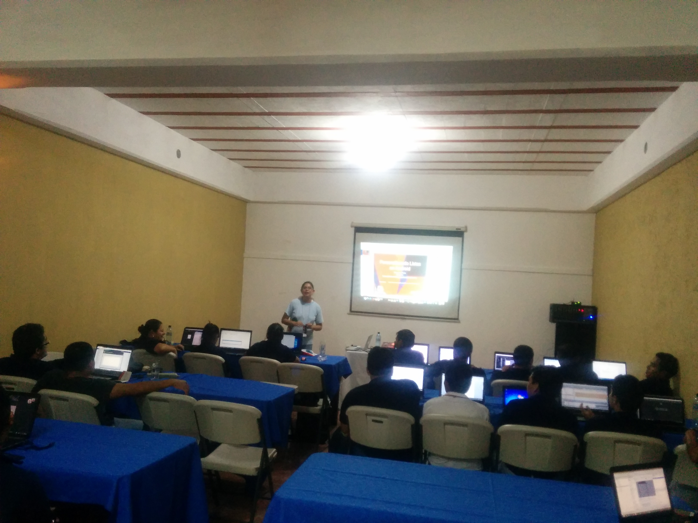
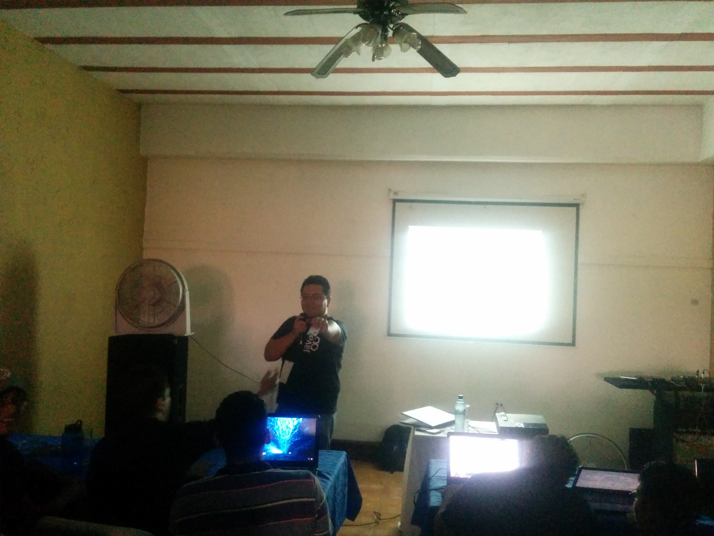
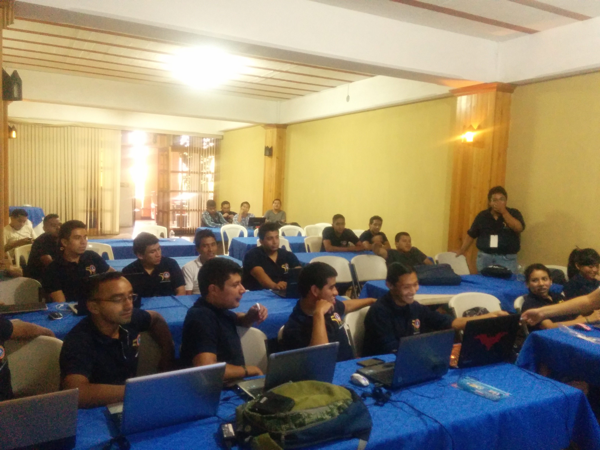
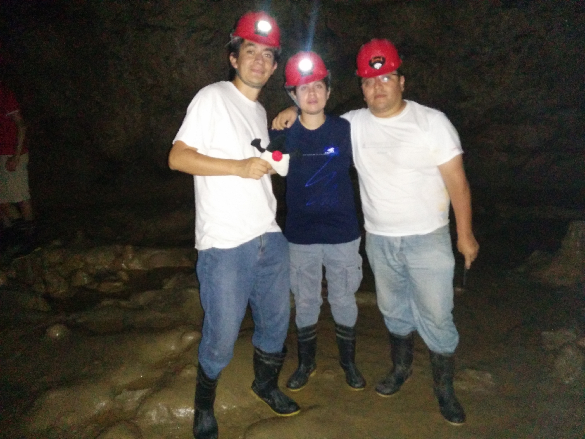
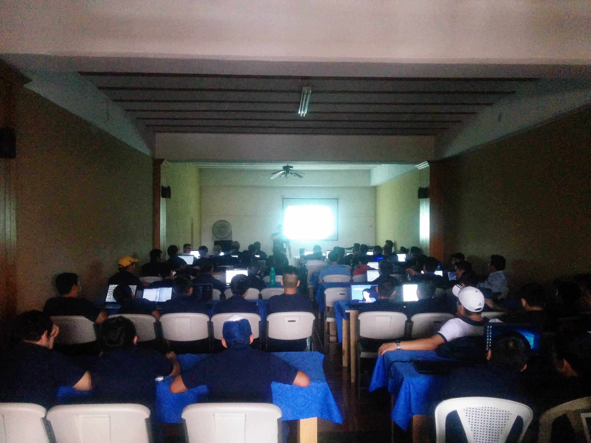

{:title "Coban Imperial"
 :layout :post
 :tags  ["guatejug","norte"]
 :toc true}

Cobán, la «ciudad imperial de Carlos V» es considerada como una de las ciudades más limpias, atractivas y tranquilas de Guatemala; además de tener un índice mínimo de delincuencia, posee un alto atractivo eco-turístico pues cuenta con cuevas que descienden cientos de metros dentro de la tierra, grutas con ríos subterráneos. Este seria nuestro primer destino eco-turistico.

En esta oportunidad GuateJUG partició como parte del **Congreso de Ingeniera en Sistemas**, de la Universidad Mariano Galvez, impartiendo los siguientes talleres:

* Como programar en Java por Víctor Orozco [@tuxtor](https://twitter.com/tuxtor)
* Introducción a la programación en Java por Maria Castillo [@marycoder](https://twitter.com/marycoder)
* EJB y Primefaces por Mario Batres [@mariobatres7](https://twitter.com/mariobatres7)

En esta oportunidad y luego de compartir con estudiantes y publico en general, tomamos un poco de tiempo para conocer el lugar conocido como **Las grutas del rey Marcos**, una serie de formaciones rocosas subterraneas provocadas por la erosión del suelo, siendo probablemente el unico grupo de usuarios Java que toma fotos a un Duke bajo tierra.

Agradecemos a nuestro contacto **Joaquin Guerrero** por facilitar nuestra visita y a nuestros anfitriones por un recibimiento inigualable.

