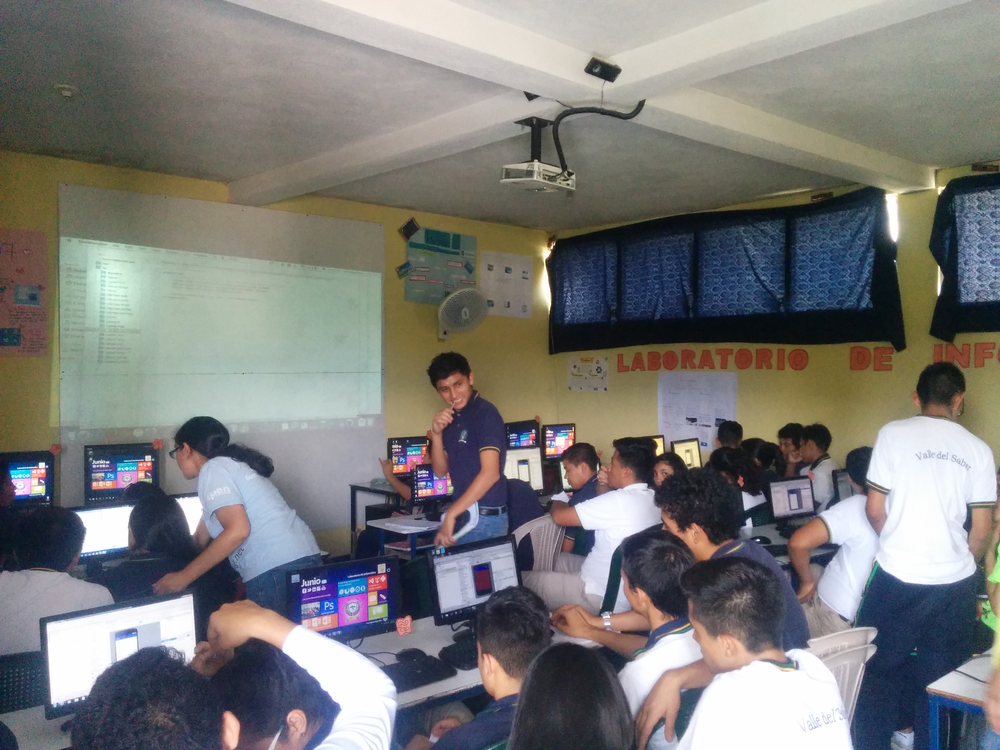
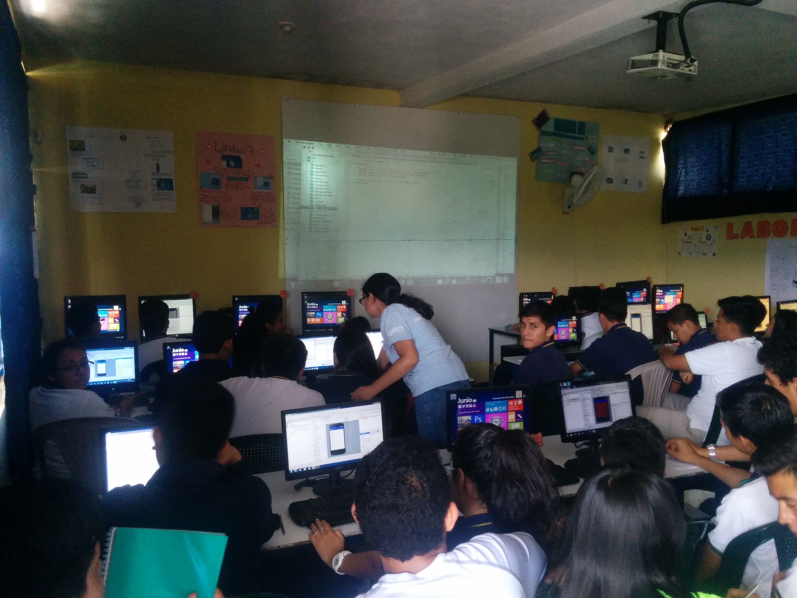
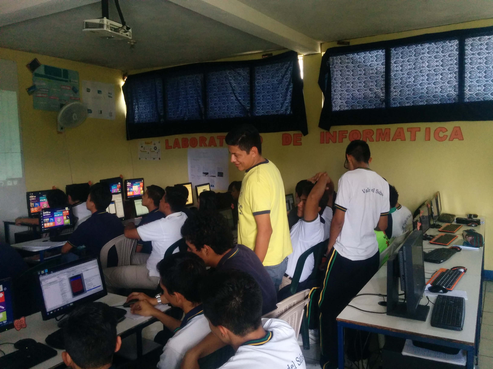
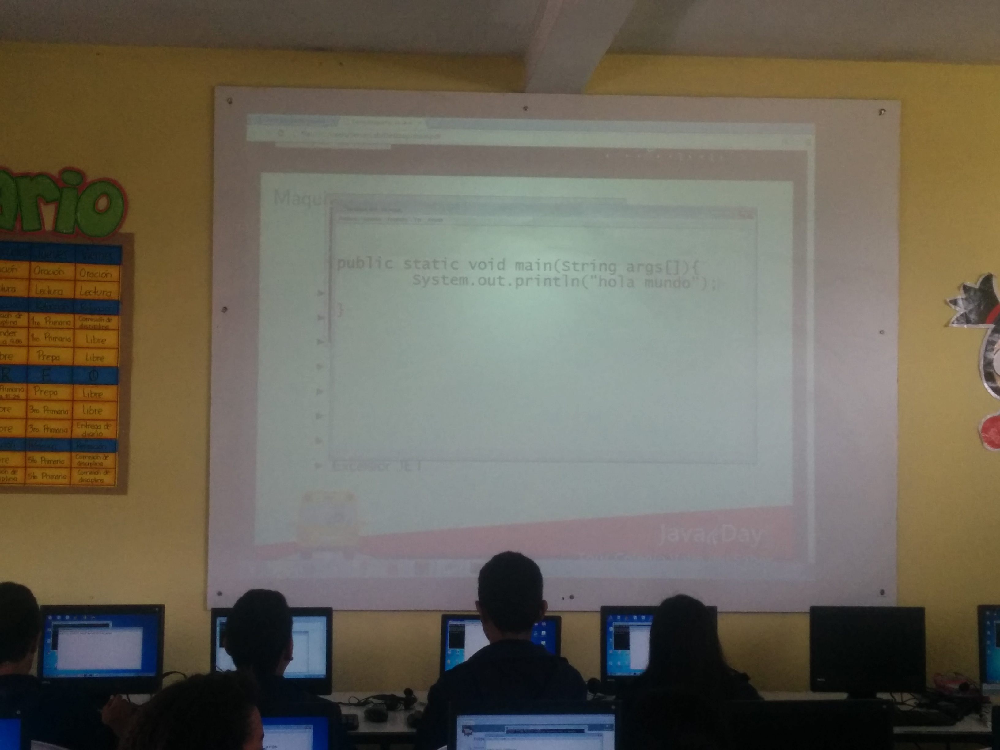

{:title "Java no es un juego de niños ... ¿o si?"
 :layout :post
 :tags  ["guatejug","centro"]
 :toc true}

El **Colegio Valle del Saber** es un colegio de enseñanza media -i.e. high school- localizado en el municipio de San Miguel Petapa,localizado al sur de la Ciudad de Guatemala.

A diferencia de otras fechas del tour, acá se impartieron charlas a un publico compuesto casi en su totalidad por niños y adolescentes, lo cual hizo que el evento fuera aun más entretenido.

En esta oportunidad muchos niños relataron que era la primera vez que tenian contacto con un lenguaje de programación, por lo que tuvimos la oportunidad de **aumentar su conocimiento de ciencias de la computación**. Para esto colaboramos con las siguientes charlas:

* Como programar en Java por Víctor Orozco [@tuxtor](https://twitter.com/tuxtor)
* Programación de listas en Android por Mercedes Wyss [@itrjwyss](https://twitter.com/itrjwyss)

Agradecemos a todo el personal del colegio por la invitación, asi como a los asistentes.

