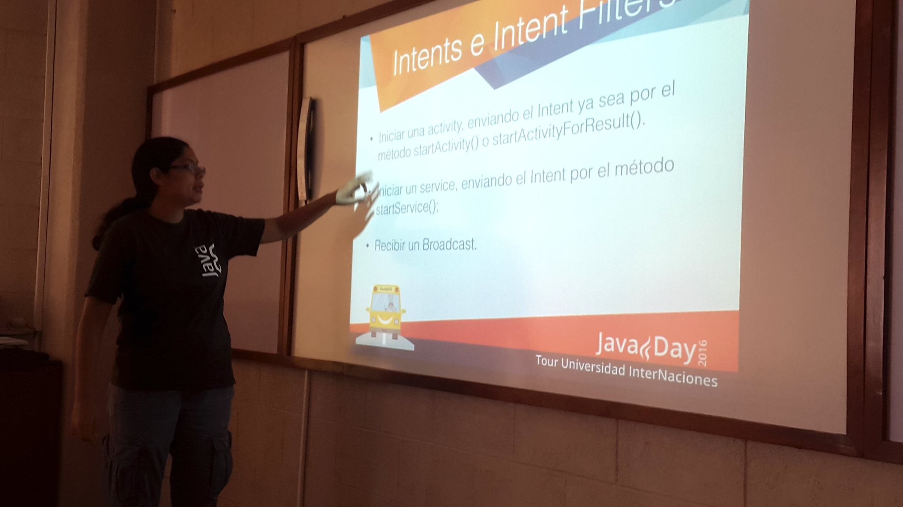
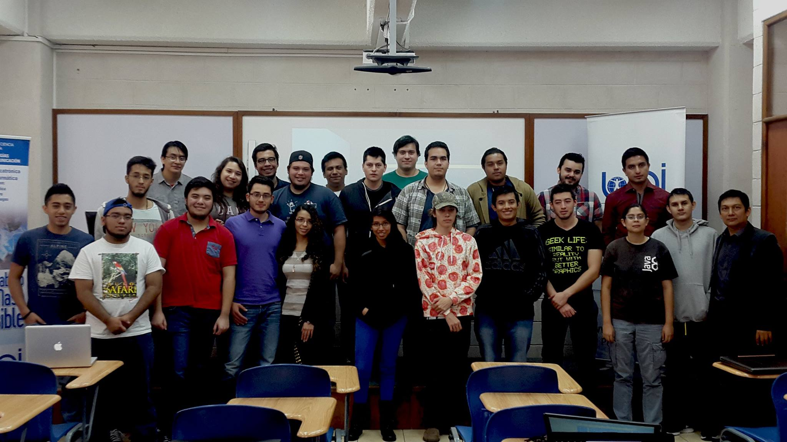
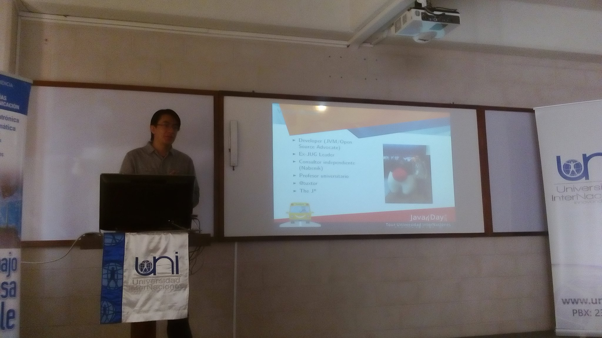

{:title "Lección inicial Universidad Internaciones"
 :layout :post
 :tags  ["tour","centro"]
 :toc true}

La Universidad InterNaciones es una universidad privada de Guatemala, **fundada en 2009**. Actualmente funciona en sus propias instalaciones en la zona 16 de la Ciudad de Guatemala.

En esta oportunidad el grupo de usuarios Java de Guatemala, fue invitado a participar como parte de la **lección inaugural** de la carrera de Ingeniería en Ciencias y Sistemas, en la cual se impartieron las siguientes charlas:

* Como programar en Java por Víctor Orozco [@tuxtor](https://twitter.com/tuxtor)
* Programación de listas en Android por Mercedes Wyss [@itrjwyss](https://twitter.com/itrjwyss)

Durante las charlas los alumnos de la universidad pudieron plantear todas sus dudas acerca de **Java como plataforma de desarrollo** y las perspectivas profesionales en el ámbito de TI. 

Agradecemos a la Universidad y al programa de Ingenieria en Sistemas por la invitación y esperamos seguir colaborando en otras oportunidades.

