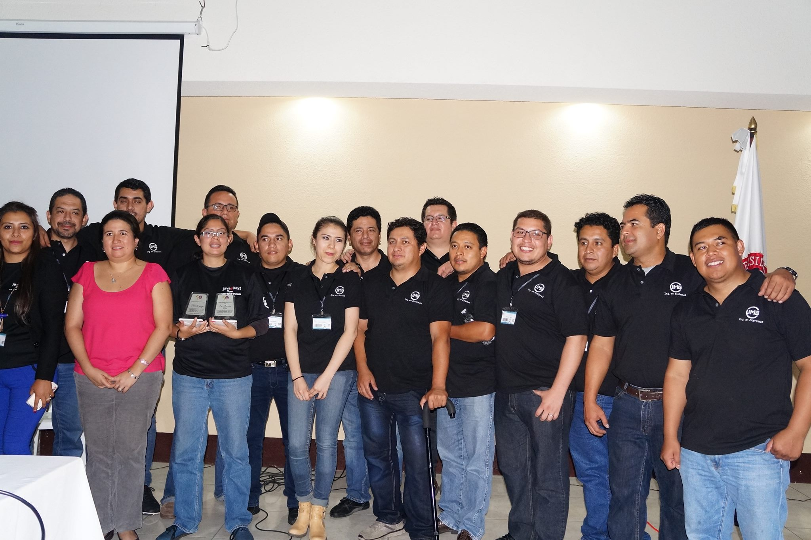
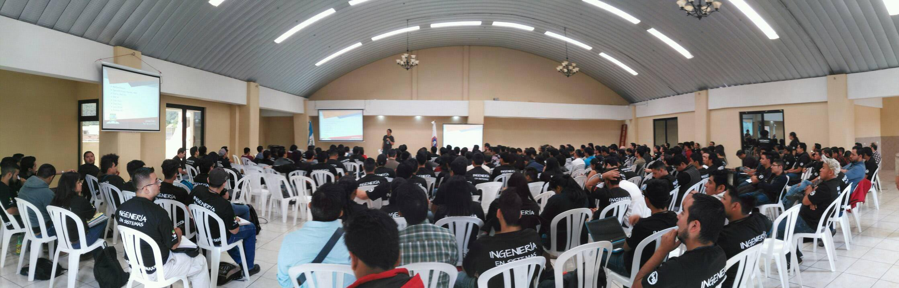
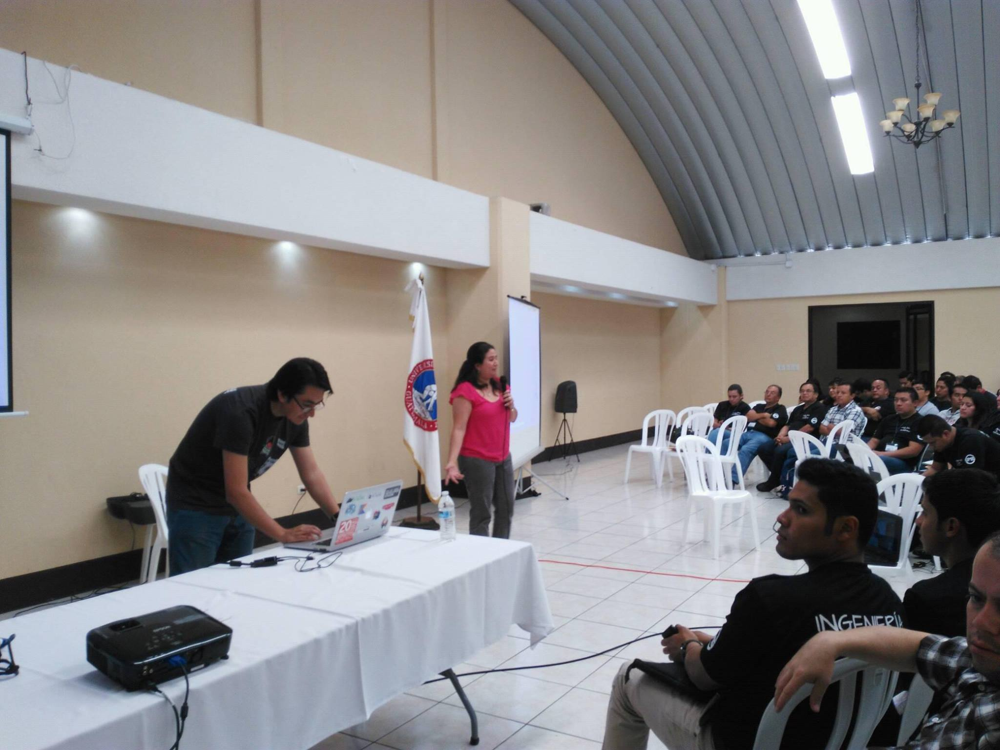
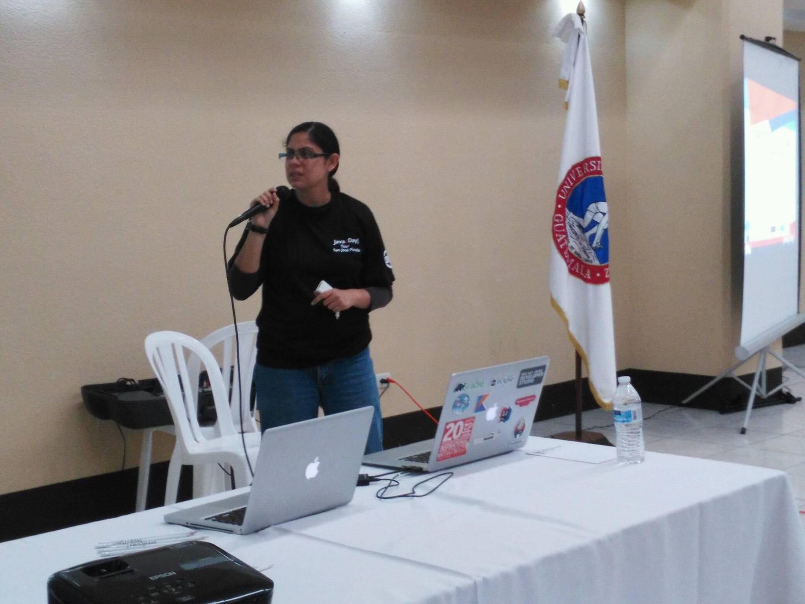
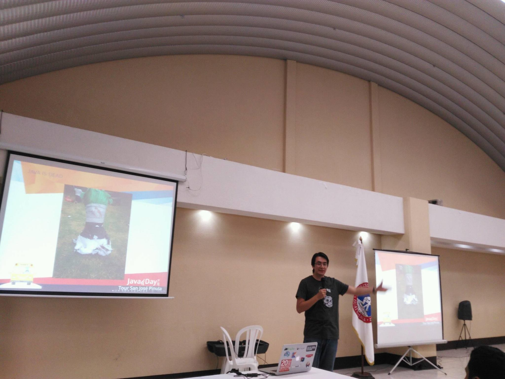
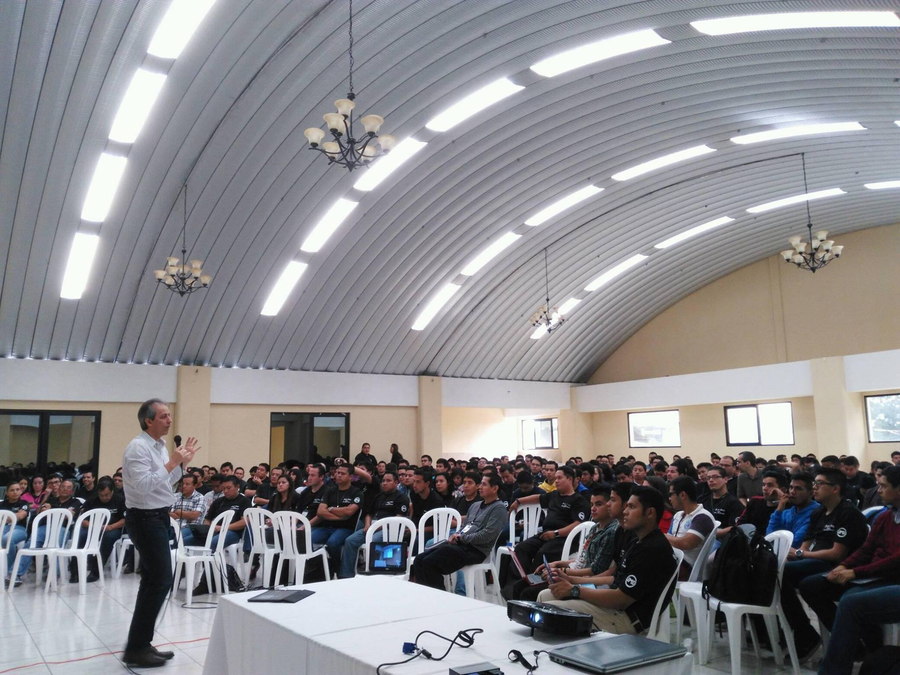
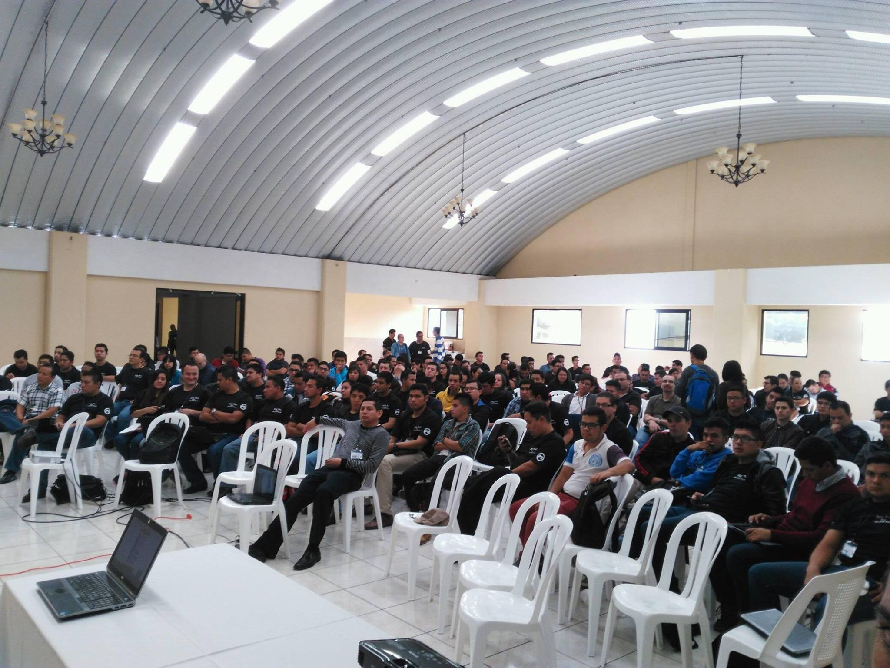

{:title "Tour San Jose Pinula"
 :layout :post
 :tags  ["tour","centro"]
 :toc true}

San José Pinula es un municipio del Departamento de Guatemala ubicado a 22 kilómetros de la capital. Se constituyó como municipio el 1 de octubre de 1886 y su nombre significa "Tierra del Pinol".

El grupo de usuarios de Java tuvo la oportunidad de colaborar con la realización del Java Day Tour en San José Pinula, en una de las mayores sedes de Ing. en Sistemas en la Universidad Mariano Galvez.

En esta oportunidad tuvimos a bien exponer las siguientes conferencias:

* El estado actual de la técnologia por Antonio Sobalvarro
* Como programar en Java por Víctor Orozco [@tuxtor](https://twitter.com/tuxtor)
* IDEs para el desarrollo Java [@guatejug)
* Introducción a la programación en Java por Maria Castillo [@marycoder](https://twitter.com/marycoder)
* Programación de aplicaciones Android por Jorge Cajas [@Jac_Mota](https://twitter.com/Jac_Mota)
* Firebase Cloud Messaging por Mercedes Wyss [@itrjwyss](https://twitter.com/itrjwyss)

A nivel general el evento de San José Pinula fue uno de los eventos con mayor afluencia (300+ personas) y que tuvo un excelente comité organizador.

Nuevamente agradecemos a la Universidad Mariano Galvez por su colaboración y especialmente a los estudiantes que hicieron posible la visita de las aventuras de Duke.

