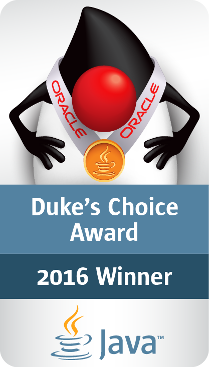
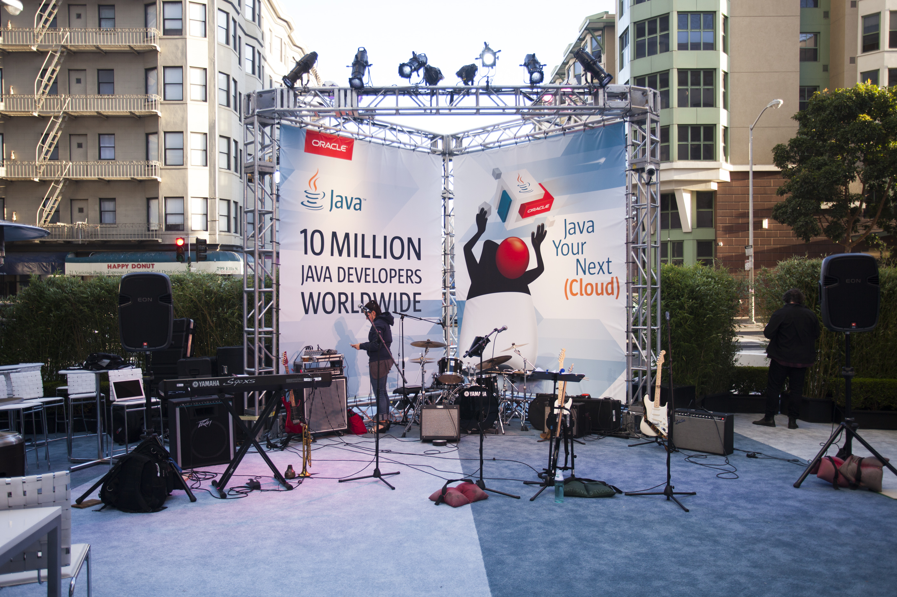
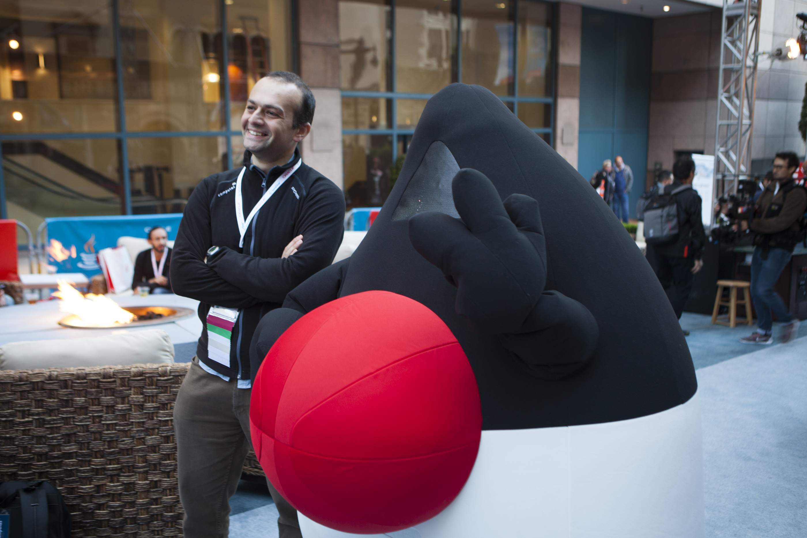
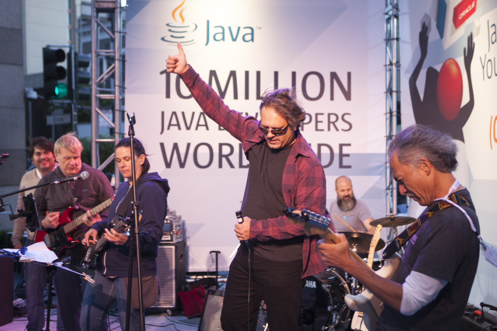
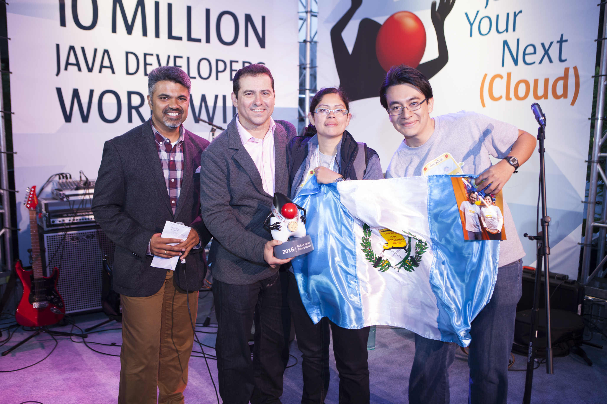
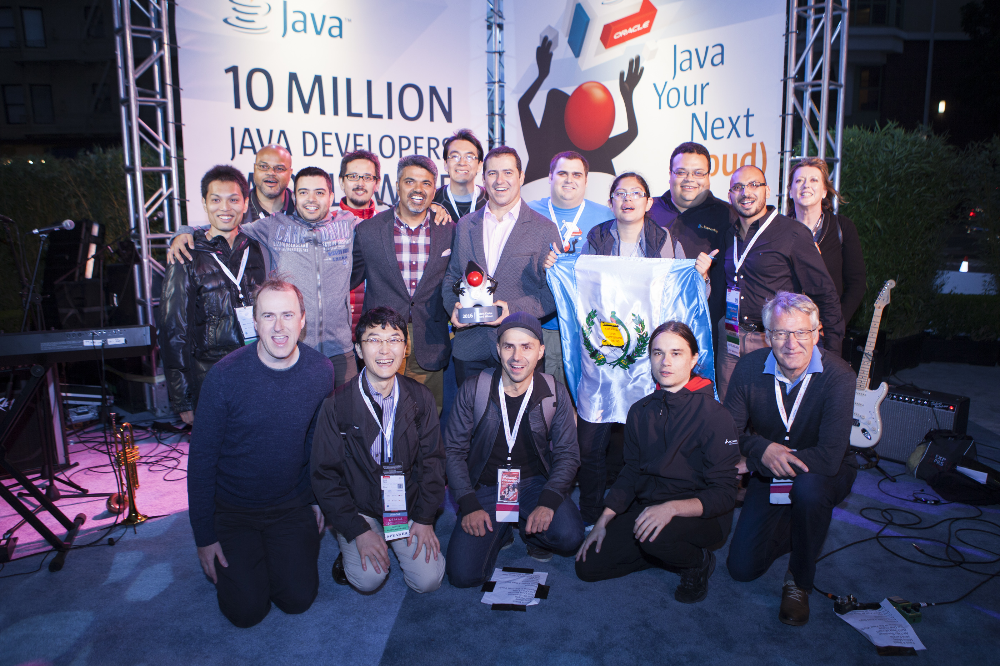

{:title "Ganadores del Duke's Choice Award 2016"
 :layout :post
 :tags  ["tour"]
 :toc true}

Los **Duke's Choice Awards son premios que estan dedicados a la comunidad**, celebran a las empresas, comunidades y entidades sin fines de lucro que estan innovando en el mundo Java y hacen posible que Java sea el [lenguaje de programación #1 del mundo](http://www.tiobe.com/tiobe-index/).

Cuando iniciamos las aventuras de Duke nunca imaginamos la real contribución que estábamos proponiendo a la comunidad de desarrolladores de Guatemala, sin embargo el día 20 de septiembre el proyecto "Las Aventuras de Duke" fue **premiado durante [Java One 2016 como uno de los 10 ganadores mundiales](https://www.oracle.com/javaone/dukes-choice-award.html)**.

Para GuateJUG esto significa **dos cosas**:

* Un aumento en el compromiso con la comunidad de desarrolladores de software de Guatemala para seguir aportando con actividades y contenido de calidad.
* Un agradecimiento a todas las personas e instituciones que actuaron en la organización del tour, están colaborando y seguirán colaborando con el tour de las aventuras de Duke.

Si deseas que las aventuras de Duke lleguen a tu ciudad escríbenos a <info@guate-jug.net>.
