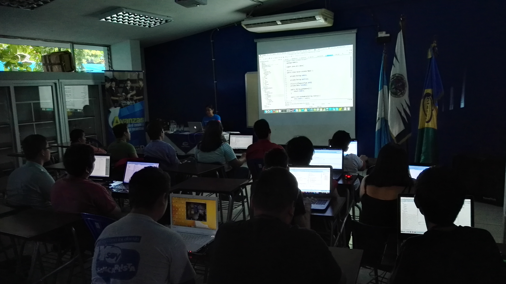

{:title "Tour Chiquimula"
 :layout :post
 :tags  ["tour","oriente"]
 :toc true}

Chiquimula es la cabecera del departamento de Chiquimula. En decadas recientes, **Chiquimula ha sido reconocido como uno de los municipios más prósperos del oriente guatemalteco**, debido al rápido crecimiento en su comercio local e internacional.

El grupo de usuarios de Java tuvo la oportunidad de colaborar con la realización del tour de las aventuras de Duke, como parte del **congreso de estudiantes de ingenieria** de la universidad estatal ([Universidad de San Carlos de Guatemala](http://ingenieriacunori.com/)).

En esta oportunidad tuvimos a bien exponer las siguientes conferencias:

* Programación funcional con Java 8 [@tuxtor](https://twitter.com/tuxtor)
* Desarrollo de aplicaciones web con Play 1.x y anotaciones [@itrjwyss](https://twitter.com/itrjwyss)

Como dato curioso **Chiquimula fue la ciudad que dio inicio al tour** de las aventuras de Duke en 2015, por lo que fue bueno regresar a la ciudad.

Nuevamente **agradecemos a la Universidad de San Carlos** por su colaboración y especialmente a los estudiantes que hicieron posible la visita de las aventuras de Duke.

