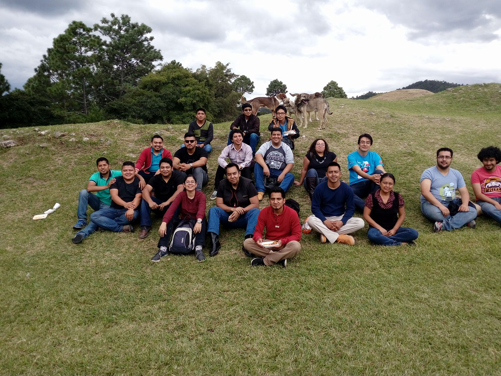
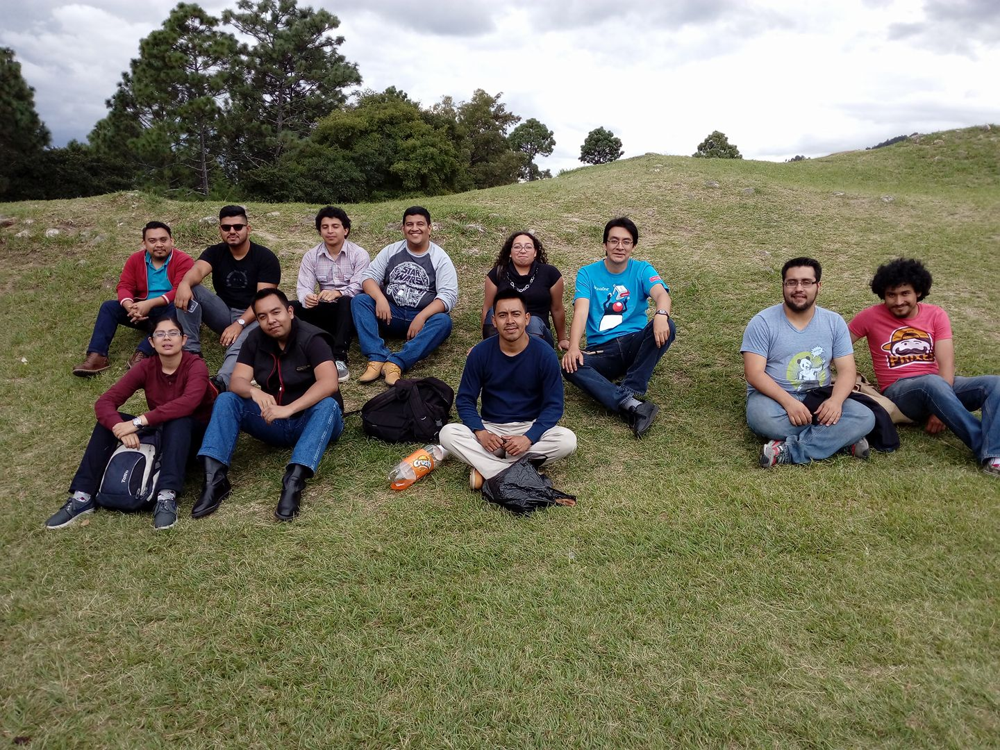
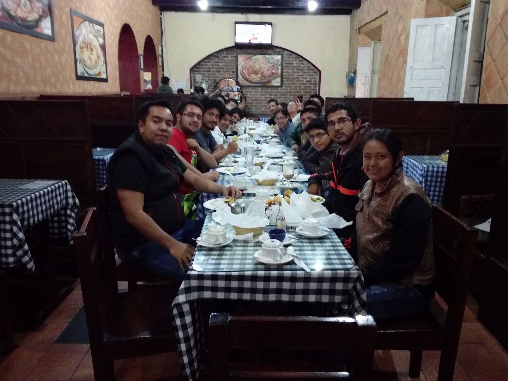

{:title "Zaculeu Tec"
 :layout :post
 :tags  ["tour","occidente"]
 :toc true}

**Huehuetenango tiene una extensión territorial de 204 kilómetros cuadrados, y cuenta con una cabecera municipal, 20 aldeas y 25 caseríos**, siendo uno de los puntos más importantes del Nor-Occidente del país. Entre sus puntos más destacables, se encuentra el sitio arqueológico Zaculeu donde se grabó una película de [Tarzan en 1967]( http://lahora.gt/tarzan-en-guatemala-dos-peliculas-en-un-escenario-inusual/).

Las aventuras de Duke tuvieron la oportunidad de llegar al **IV Congreso de Tecnología e Informática de [ASITI](https://www.facebook.com/ASITIH)**, una asociación dedicada al fomento de la ciencia y la tecnología en el área de Huehuetenango. 

En esta oportunidad tuvimos a bien exponer la siguiente conferencia:

* Programación funcional con Java [@tuxtor](https://twitter.com/tuxtor)

El evento fue interesante ya que logró reunir a varios lideres de diferentes comunidades tecnológicas en Guatemala, incluyendo comunidades de Software y Hardware.

Algunas imágenes del evento:

Agradecemos a ASITI la invitación al evento y la recepción de primer nivel que nos brindaron.
