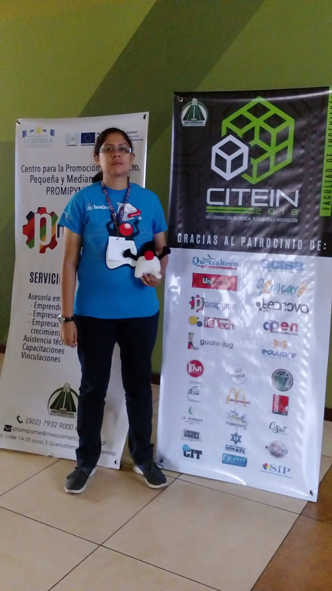
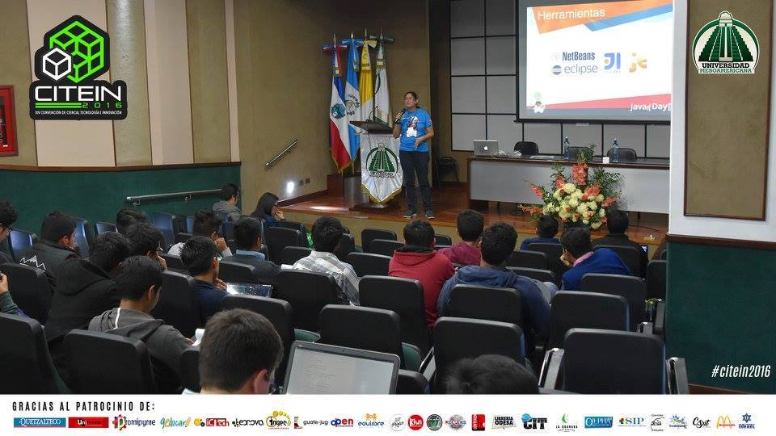
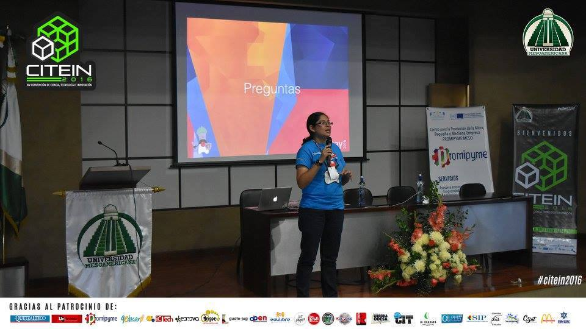
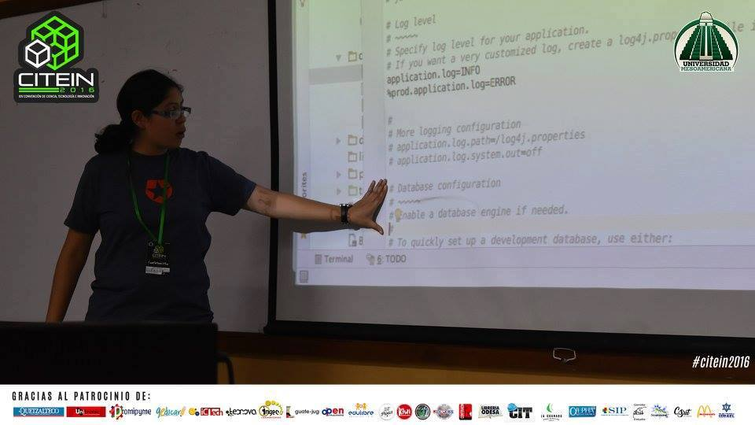

{:title "Citein"
 :layout :post
 :tags  ["guatejug","occidente"]
 :toc true}

**GuateJUG tuvo nuevamente el honor de visitar con las aventuras de Duke la ciudad de Quetzaltenango**, en esta oportunidad fuimos invitados a participar en CITEIN -Convención de Ciencia, Tecnología e Innovación Universidad Mesoamericana, Facultad de Ingeniería- organizado por la [Universidad Mesoamericana](http://www.mesoamericana.edu.gt/), una de las universidades de mayor tradición en computación en el occidente del país.

En esta oportunidad GuateJUG participó impartiendo los siguientes talleres:

* Como programar en Java [@itrjwyss](https://twitter.com/itrjwyss)
* Desarrollo de aplicaciones web con Play 1.x y anotaciones [@itrjwyss](https://twitter.com/itrjwyss)

Siendo uno de los eventos más importantes de la región, **los talleres fueron impartidos a más de 450 personas** durante dos días.

Agradecemos a la Universidad Mesoamericana por la invitación y esperamos que nuestra participación sea la **semilla de nuevos desarrollos Java en occidente**.

