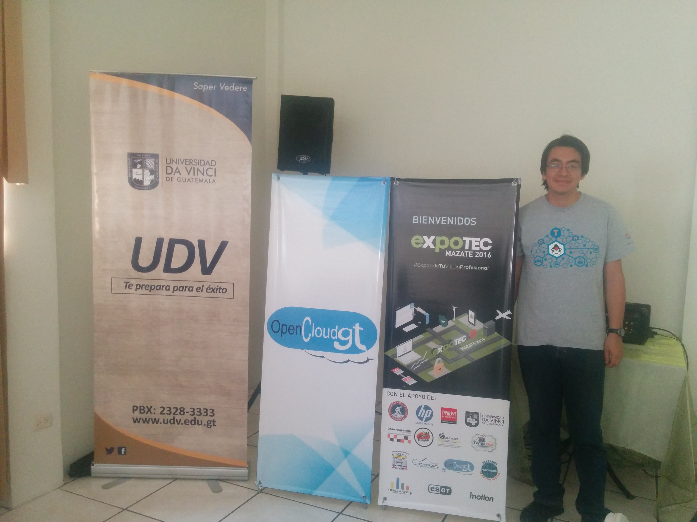
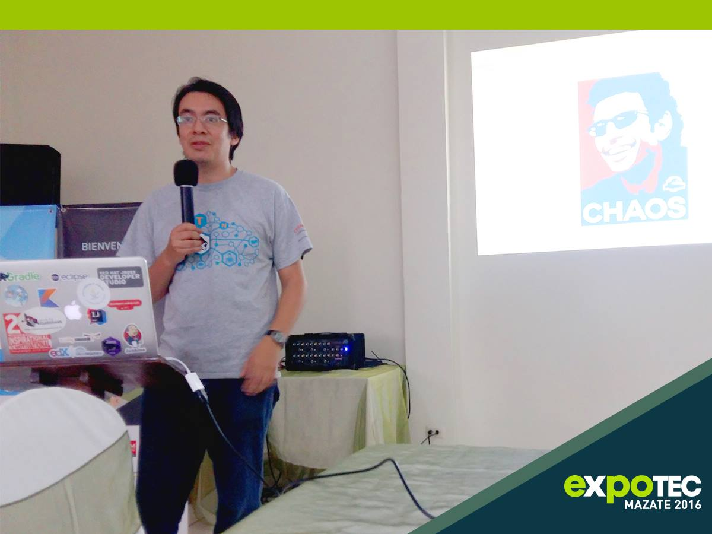
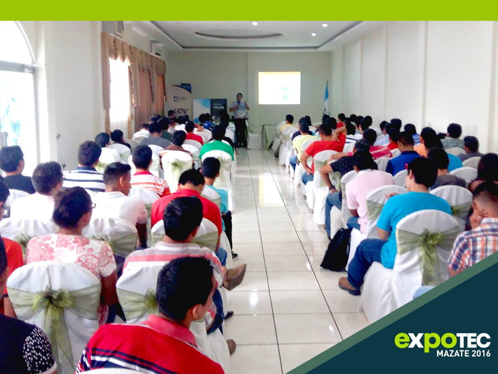
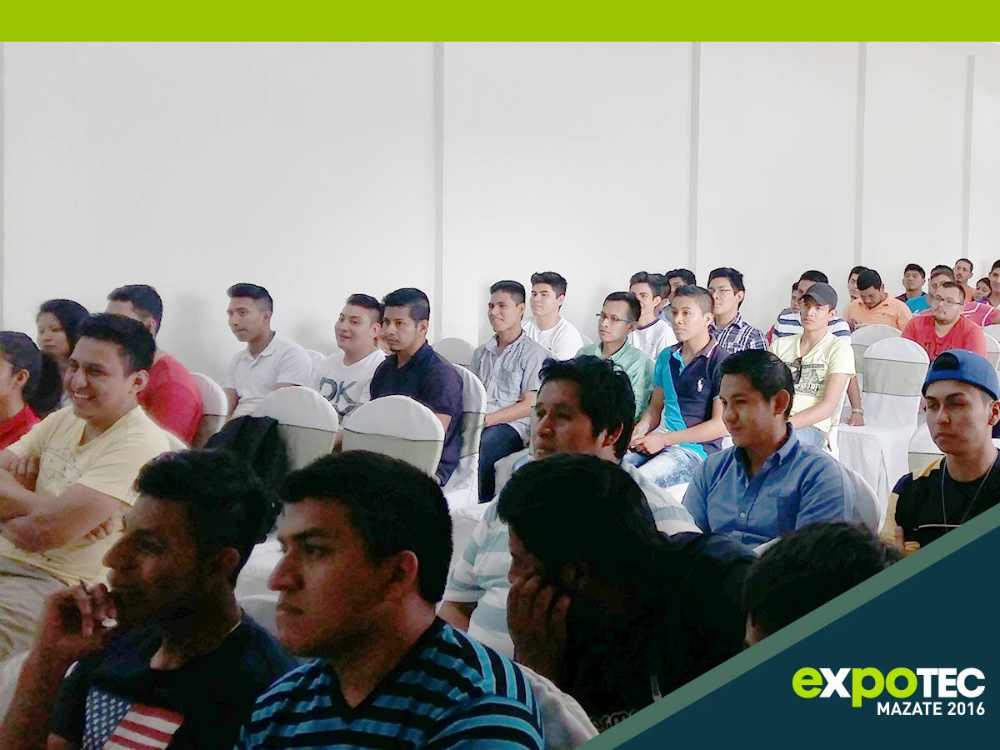

{:title "Expotec Mazatenango"
 :layout :post
 :tags  ["guatejug","sur"]
 :toc true}

**El Municipio de Mazatenango se encuentra localizado en la parte centro occidental del departamento de Suchitepéquez**. Se ubica a unos 160 km de la capital de Guatemala, siendo una ciudad particularmente conocida por su cercanía de numerosas ciudades pequeñas favoreciendo el comercio, y por su equipo de fútbol los venados de Suchitepequez.

**GuateJUG tuvo el honor de visitar Mazatenango con las aventuras de Duke, en el evento denominado Expotec**. Diferente de otras visitas que se realizaron con apoyo de algunas Universidades locales, en esta ocasión el evento fue auto-organizado por un grupo de profesionales de la región, invitando a expositores en áreas de emprendimiento, seguridad informática, y por supuesto desarrollo en Java :).

**En esta oportunidad GuateJUG participó** impartiendo las siguientes conferencias:

* Como programar en Java [@tuxtor](https://twitter.com/tuxtor)
* Introducción al desarrollo de aplicaciones en Android [@tuxtor](https://twitter.com/tuxtor)

Agradecemos a los organizadores de Expotec por hacernos sentir como en casa, esperamos que nuestra participación haya sido del agrado de los asistentes, y **los felicitamos por tener la iniciativa de realizar estos eventos en beneficio de la región**.

