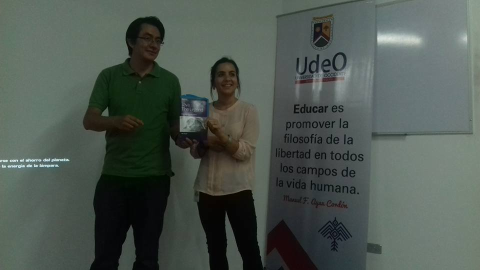

{:title "GuateJUG bootcamp"
 :layout :post
 :tags  ["tour","centro"]
 :toc true}

En alianza con [Universidad de Occidente](http://www.universidaddeoccidente.org/), **GuateJUG realizó durante el mes de Abril su primer Java Bootcamp**. Durante una semana el grupo dio a conocer Java como lenguaje, plataforma y maquina virtual a los diferentes sectores interesados en el país, siendo hasta cierto punto nuestra primera Java mini-conf.

En esta oportunidad tuvimos **presentaciones durante cuatro dias**, en la cual se tuvieron en promedio 50 asistentes por día, con las siguientes charlas:

* Como programar en Java por Víctor Orozco [@tuxtor](https://twitter.com/tuxtor)
* IDEs para el desarrollo Java por  Mario Batres [@mariobatres7](https://twitter.com/mariobatres7)
* Anotaciones en Java por Jorge Cajas [@Jac_Mota](https://twitter.com/Jac_Mota)
* Programación en JSF por Maria Castillo [@marycoder](https://twitter.com/marycoder)
* Introducción al desarrollo en Apache Sling por Angel Chanquin [@dechankingston](https://twitter.com/dechankingston)

Algunas imágenes del evento:

Agradecemos a los organizadores del evento por la invitación, y esperamos poder trabajar en conjunto en próximas actividades.
