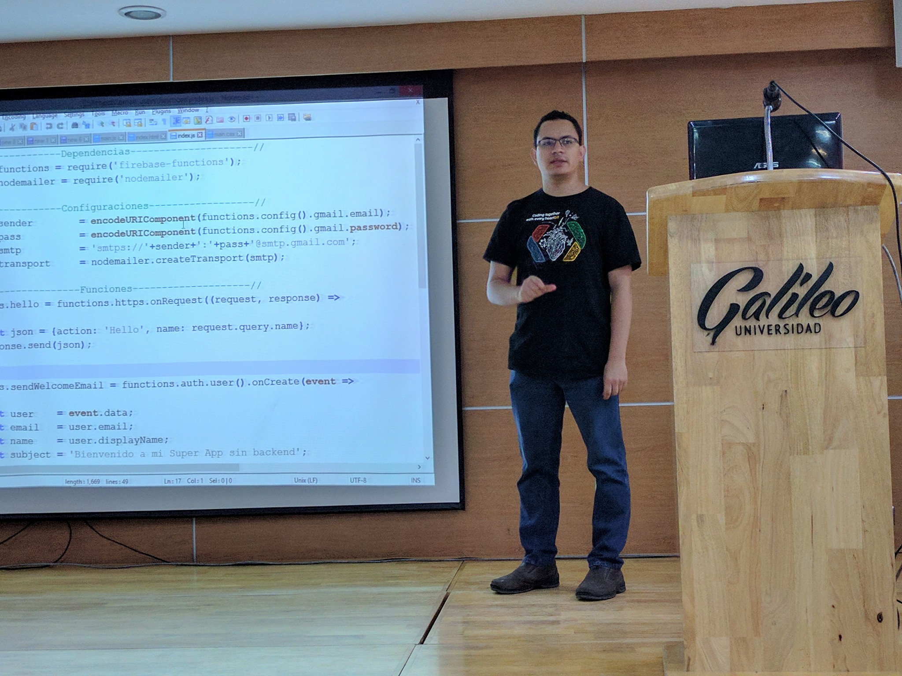
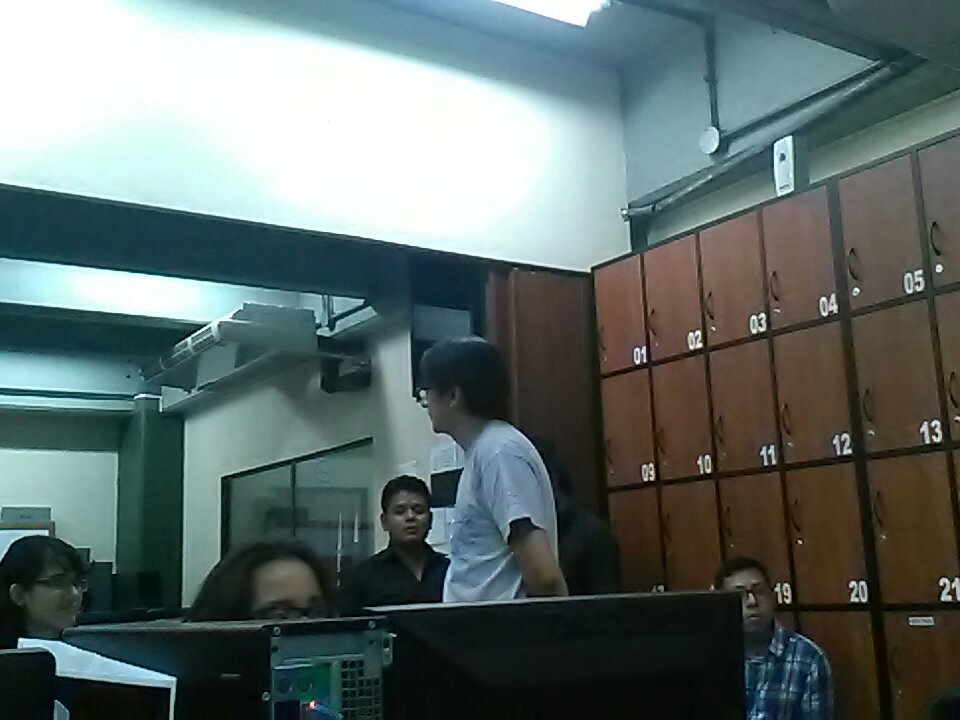
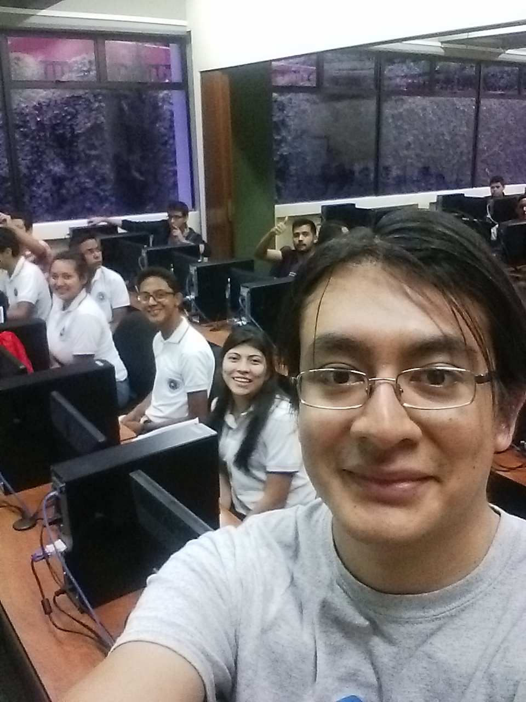

{:title "Google I/O Extended"
 :layout :post
 :tags  ["tour","centro"]
 :toc true}

Durante el mes de Mayo y gracias a la invitación del GDG de Guatemala [Cultura Android](https://www.facebook.com/androidgt/), el grupo de usuarios Java de Guatemala -GuateJUG- fue junto a otros grupos **uno de los invitados para participar como expositores en Google I/O Extendend** en Universidad Galileo.

En esta oportunidad participamos con dos charlas:

* Firebase + Cloud Functions [@Jac_Mota](https://twitter.com/Jac_Mota)
* Introducción al aprendizaje de maquina con Java [@tuxtor](https://twitter.com/tuxtor)

Una de las particularidades del evento es que a pesar de estar enfocado en tecnologías de Google, en el evento se cubrieron temas periféricos para la **participación en todos los niveles**, desde estudiantes de nivel medio hasta profesionales en el ramo de TI.

Algunas fotos del evento:

Para GuateJUG fue **un gusto compartir con otros grupos de usuarios, y ser parte de esta sinergia comunitaria en TI**.
