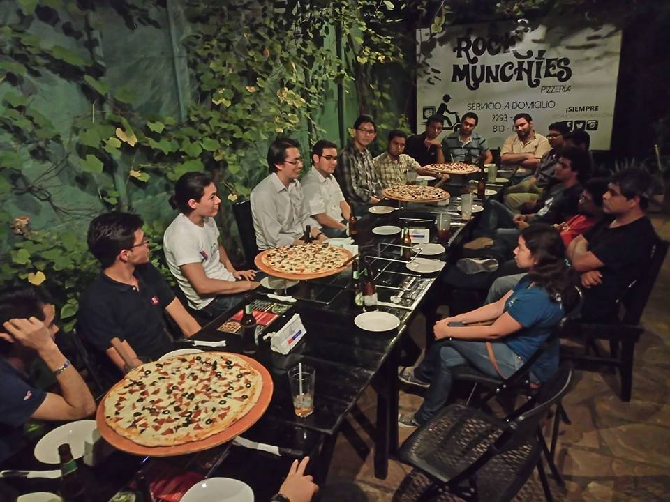
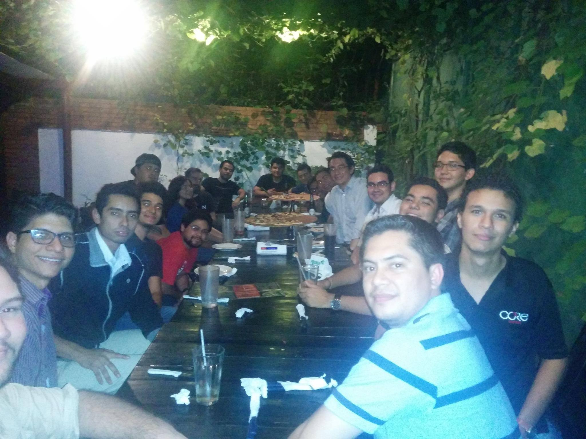

{:title "Java 9, FP y Kotlin en Nicaragua"
 :layout :post
 :tags  ["tour","oriente"]
 :toc true}

**[Managua](https://es.wikipedia.org/wiki/Managua) es la ciudad capital de Nicaragua y cabecera del Municipio y Departamento homónimos**, así como la sede del gobierno y los poderes del estado.

Durante el mes de mayo el tour de **las aventuras de Duke traspasó por primera vez las fronteras de Guatemala**, realizando su primer evento en conjunto con el [Google Developer Group de Managua](https://www.facebook.com/gdgmanagua/), una reunión informal al estilo de nuestras deconferencias en su definición literal:

> Reuniones informales, donde podemos compartir con los miembros de GuateJUG y donde todos pueden exponer sus experiencias, inquietudes y comentarios acerca de su día a día con los lenguajes de la Java Virtual Machine.

En esta oportunidad participamos con una charla:

* Java 9, Kotlin y programación funcional por [@tuxtor](https://twitter.com/tuxtor)

Y por parte del GDG Managua:

* Fritangueando y como hacer un rápido proceso de desarrollo por [Paulo McNally](https://github.com/paulomcnally)

Con alrededor de 20 asistentes, **este ha sido sin duda uno de los eventos más interesantes**, especialmente por el entorno donde el GDG está conformado por desarrolladores de la más diversa naturaleza (Android, .net, Java, JavaScript) creando una interacción única.

**Agradecemos a la gente de Nicaragua y al GDG por ayudarnos a llevar a cabo este evento**. Esperamos tenerlos en Guatemala para hacer la segunda parte de esta reunión :).

