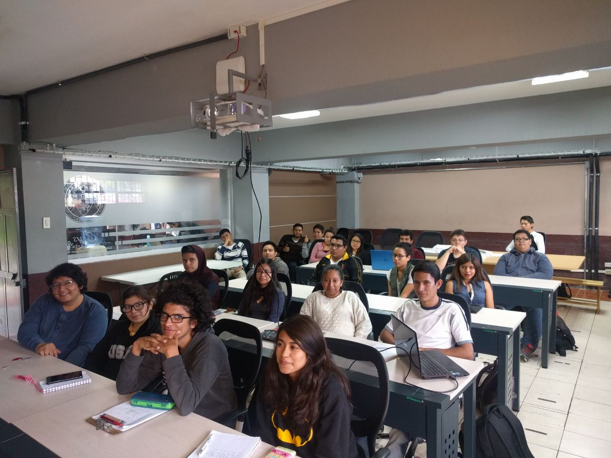
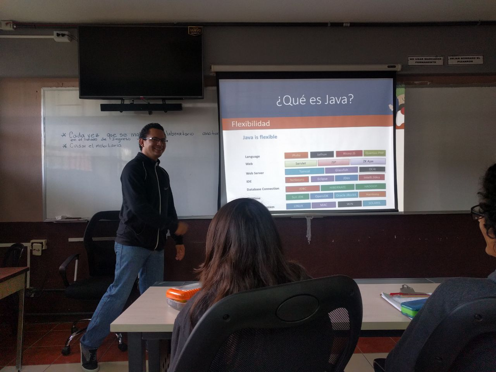

{:title "Java y su ecosistema en la USAC"
 :layout :post
 :tags  ["tour","centro"]
 :toc true}

La Universidad de San Carlos de Guatemala (también conocida y llamada por sus siglas: USAC) es la universidad más grande de Guatemala y entre sus particularidades podemos mencionar que tiene **uno de los programas en ciencias de computación más antiguos del país.**

Invitados por personal de la escuela de ciencias y sistemas (ECYS), las Aventuras de Duke llegaron para compartir con los **estudiantes de pregrado que estan iniciando su jornada en Java** y el desarrollo de POO en general.

En esta oportunidad participamos con una charla:

* Java y su ecosistema por Jorge Cajas [@Jac_Mota](https://twitter.com/Jac_Mota)

Como anecdota podemos mencionar que siempre que regresamos a USAC recordamos cuando se formó la actual versión de GuateJUG entre la **union del Open Source University Meetup de Sun Microsystems y la "iteración" anterior de GuateJUG**, una pagina completa de la historia de la computación en Guatemala nacio ahi :).

**Agradecemos a la gente de USAC por la invitación** y esperamos verlos en Java Day 2017.

