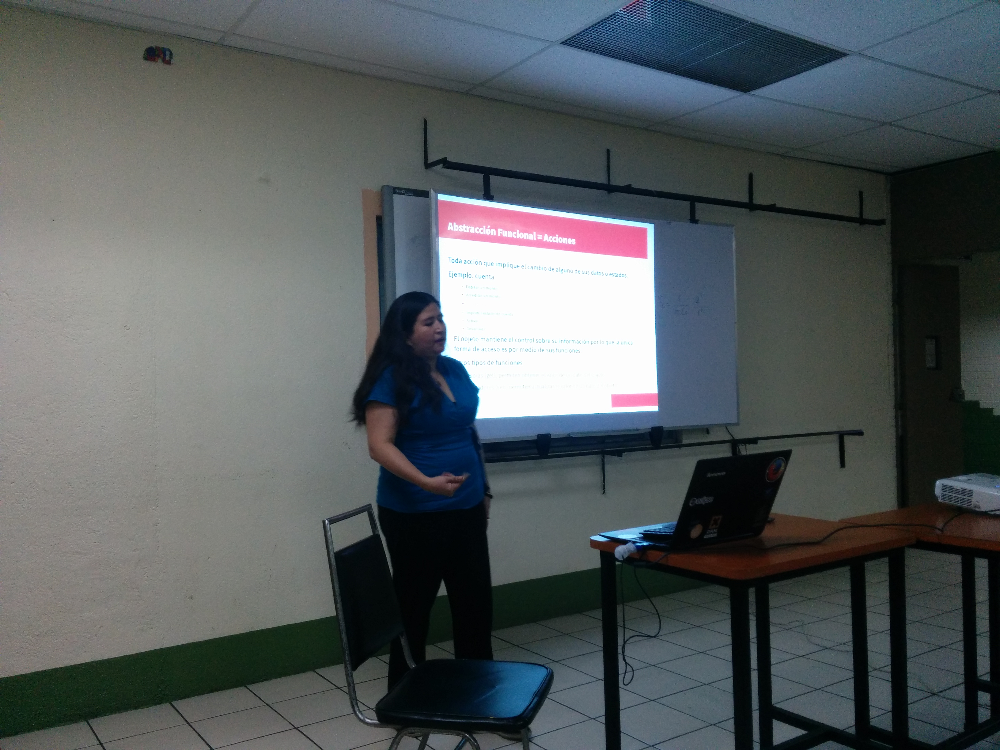
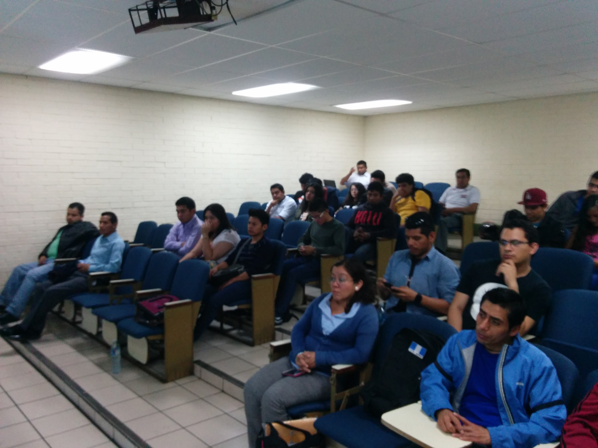
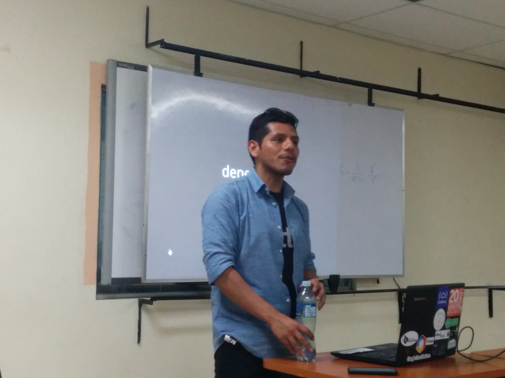
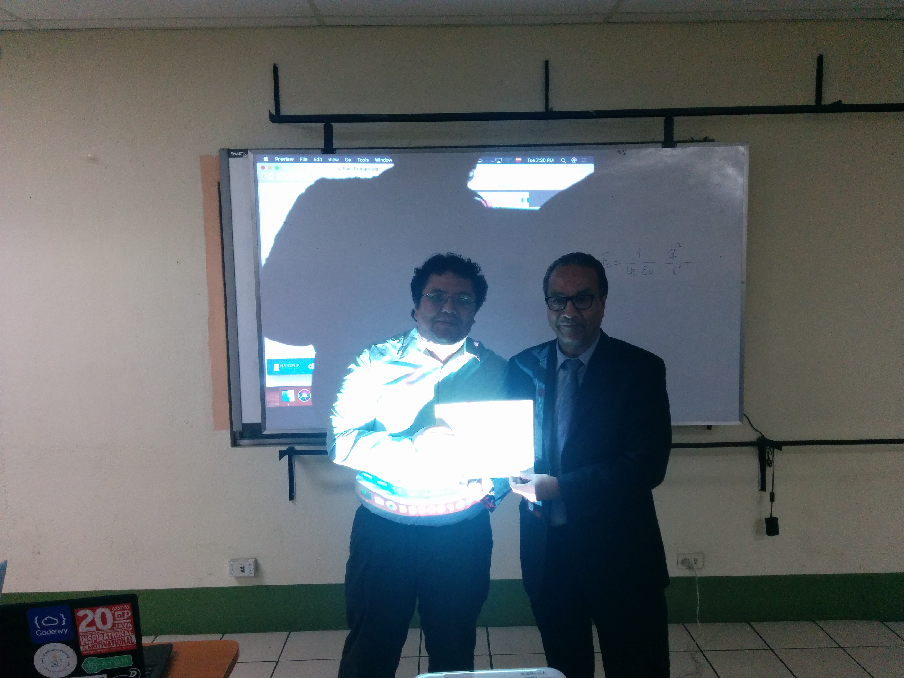
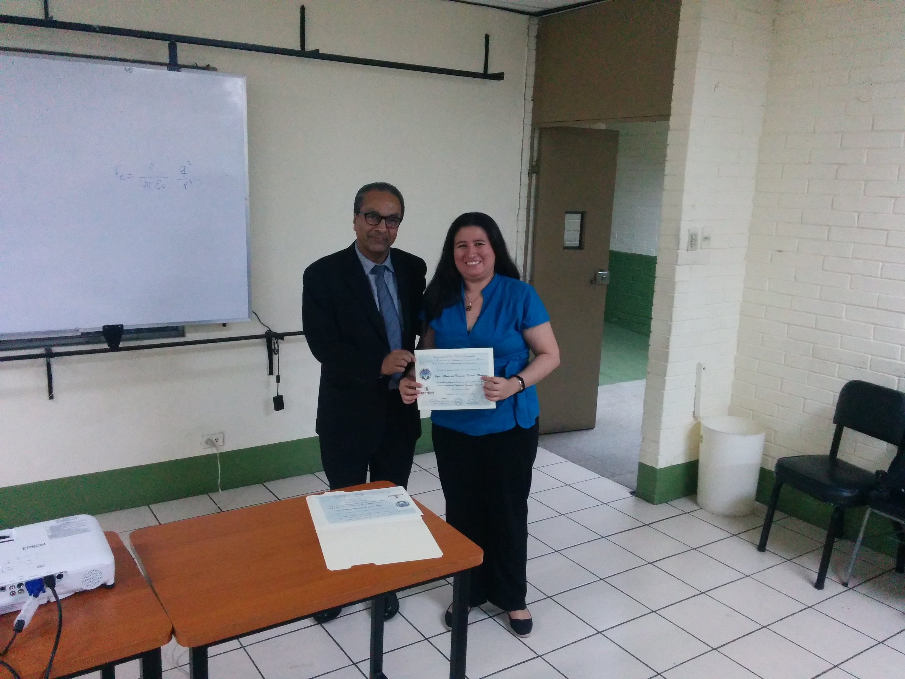
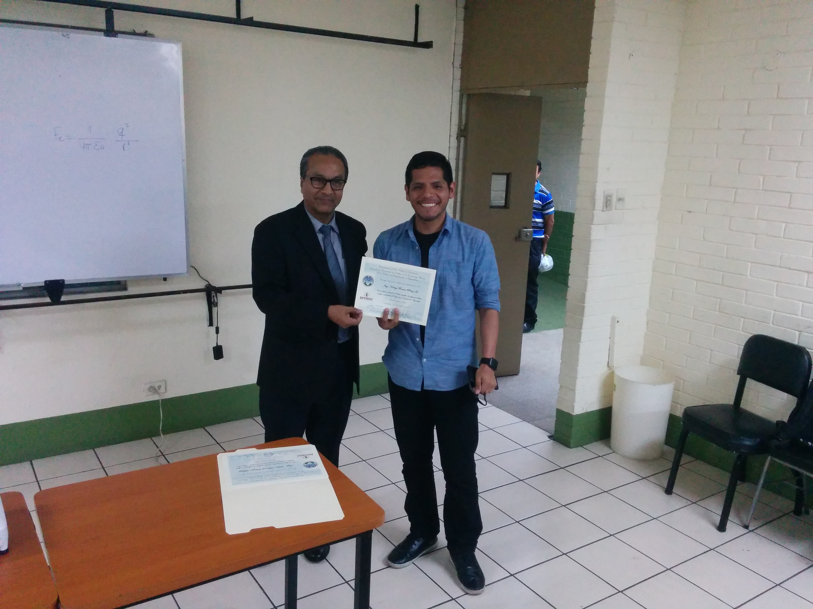
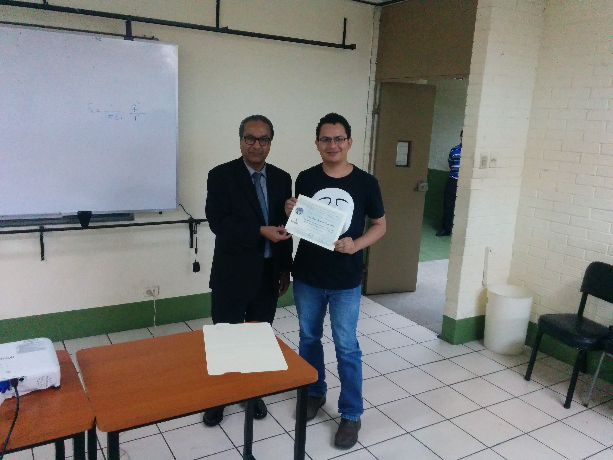

{:title "Un vistazo educativo a Java en EFPEM"
 :layout :post
 :tags  ["tour","centro"]
 :toc true}

En atención a una invitación por parte de la escuela de formación de profesores de enseñanza media -EFPEM-. Los miembros de las aventuras de Duke y un invitado especial pudieron compartir con **los futuros profesores de enseñanza media en computación** acerca de las ventajas y desventajas de Java como plataforma de desarrollo.

De todas las participaciones que hemos tenido esta es una de las pocas que se hacen fuera del ámbito de la ingeniería por lo que para nosotros fue **un reto y a la vez un gusto ver tantas personas interesadas en Java como lenguaje de programación**. Especialmente futuros profesores de jóvenes en edad escolar.

En esta oportunidad participamos con varias charlas:

* Introducción a la programación orientada a objetos[@marycoder]( https://twitter.com/marycoder)
* IDEs en Java [@mariobatres7](https://twitter.com/mariobatres7)
* Introducción a la programación en Android [por Kerry Perez]( https://github.com/KerryHeroVitamin)

**Agradecemos a la gente de EFPEM por la invitación (especialmente a José Luis y su equipo por las gestiones)**, esperamos que consideren Java como una alternativa para las próximas generaciones.

Asi mismo agraecemos a Kerry por unirse a dar una charla desde Perú, el estaba como speaker en Droid4Droids y fue una sorpresa agradable tenerlo como invitado.

