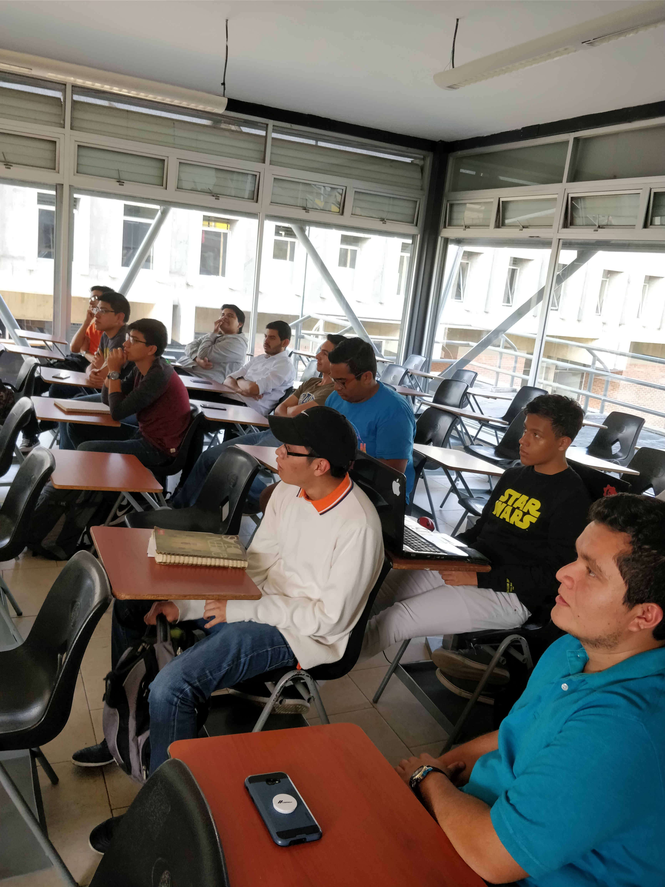
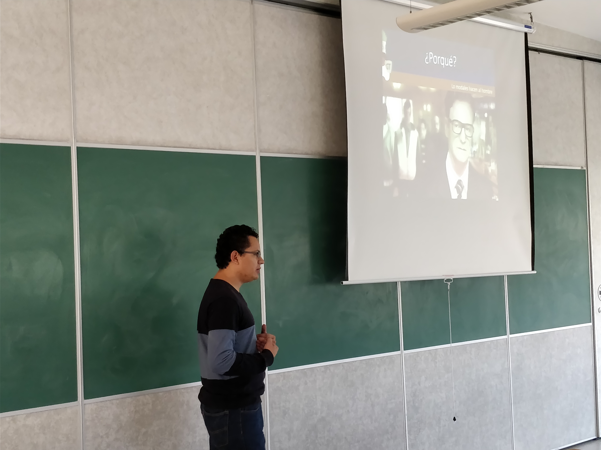
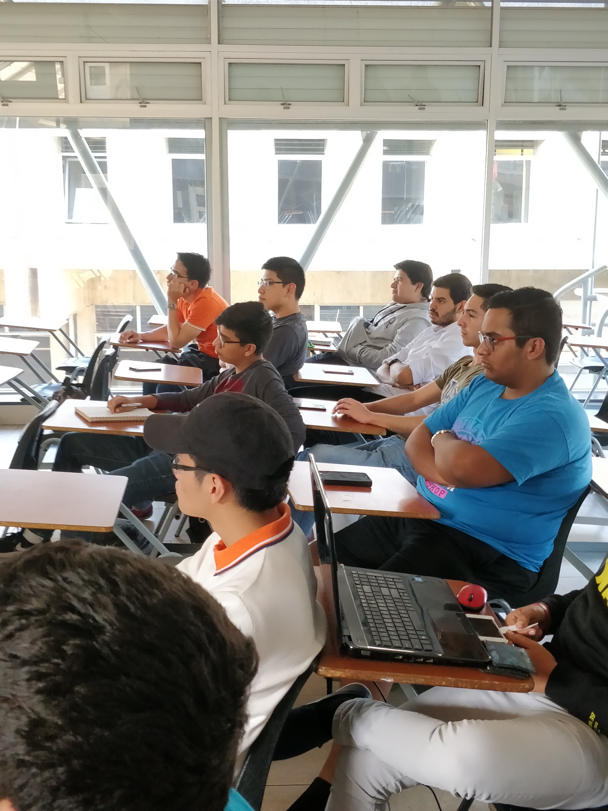
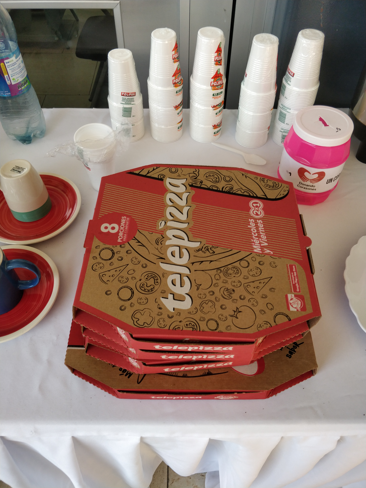
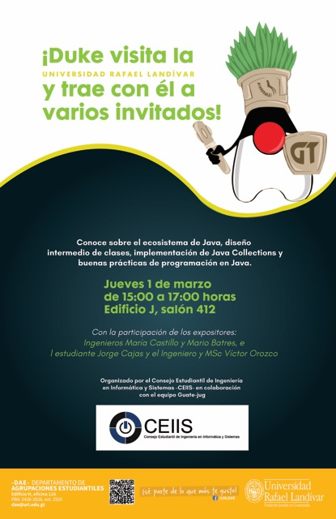

{:title "Java en la URL"
 :layout :post
 :tags  ["tour","centro"]
 :toc true}

La Universidad Rafael Landivar (también conocida y llamada por sus siglas: URL) es la universidad privada más antigua de Guatemala y entre sus particularidades podemos mencionar que tiene **uno de los programas más solidos en ciencias de la computación del país.**

Invitados por el consejo de estudiantes de Ingenieria en Sistemas (CEIIS), las Aventuras de Duke llegaron para compartir con los **estudiantes de pregrado que estan iniciando su jornada en Java** y el desarrollo de POO en general.

En esta oportunidad participamos con tres charlas:

* Java y su ecosistema por Víctor Orozco [@tuxtor](https://twitter.com/tuxtor)
* Buenas practicas de programación por Jorge Cajas [@cajasmota](https://twitter.com/cajasmota)
* Java y su ecosistema por Mario Batres [@mariobatres7](https://twitter.com/mariobatres7)

Un dato interesante es que entre las universidades de Guatemala, URL no es conocida por su afinidad a Java :P. Pero nos alegra que el programa de computación este dando mayor apertura a tecnologias open source y de código abierto.

**Agradecemos a CEIIS por la invitación** y esperamos ver a varios de ustedes en nuestras reuniones mensuales.

